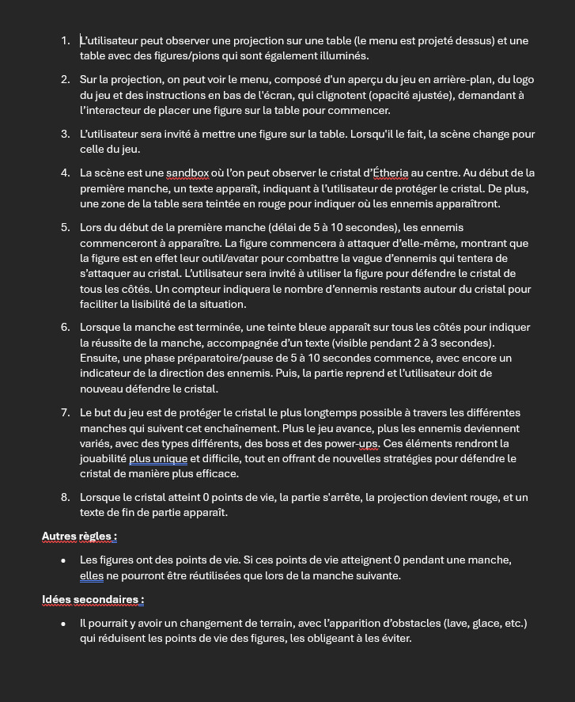
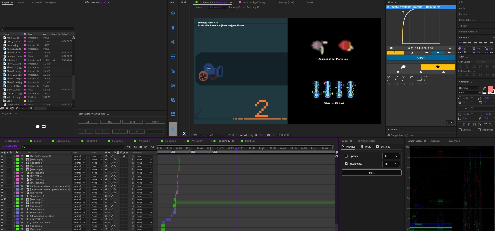
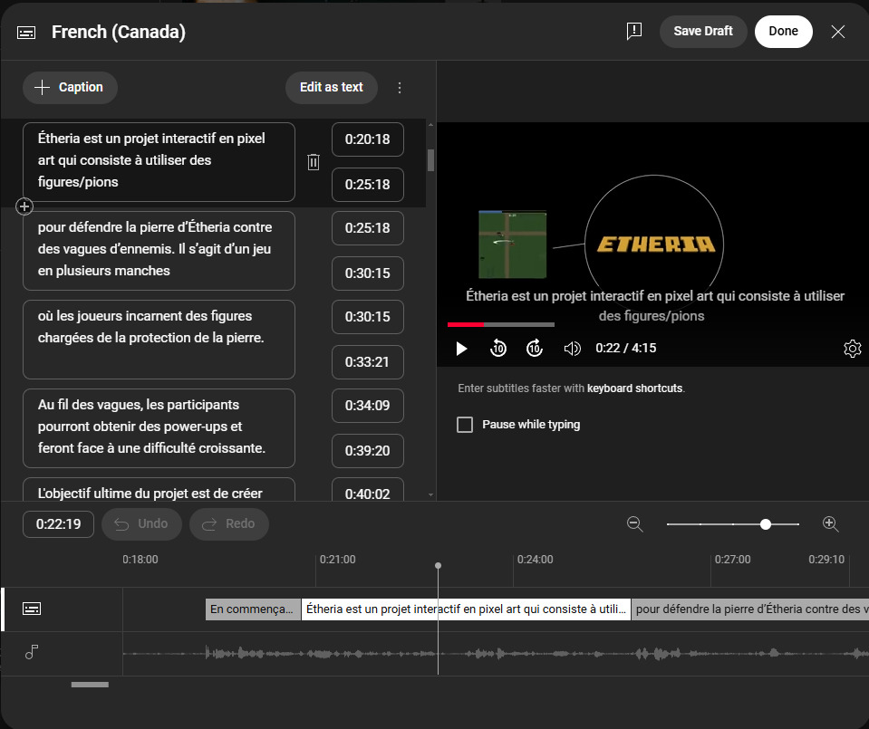
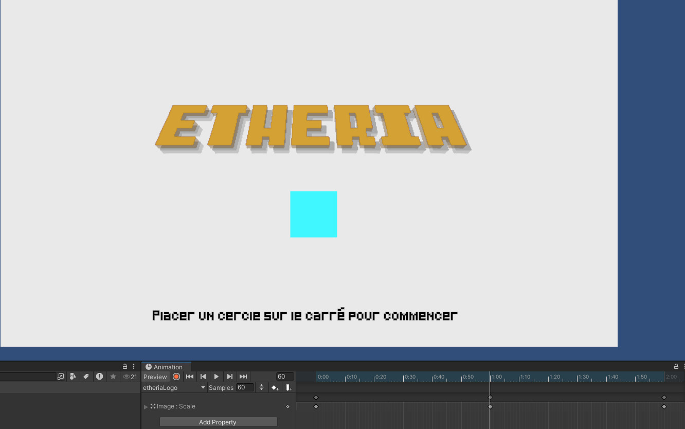

# Joshua Gonzalez-Barrera

<!---->


 ## Réalisations

 <!-- Une image par semaine de la réalisation dont tu es le plus fier avec une légende -->
### Semaine 1
Reconception du projet, refaire le github au complet. Notre idée principale n'était pas si bonne, donc est retourné à la case départ. Avec mon équipe, j'ai écrit notre nouvel concept de projet, en ajoutant le plus de détails possibles et de décrire l'expérience dans la vision de l'intéracteur. Nous avons eu l'autorisation de continuer avec cette idée.



### Semaine 2
Production de la vidéo explicative sur After Effects. Je suis allé pour une approche inspiré par les types de vidéos explicatives avec des graphiques que j'ai vue sur Youtube. J'ai aussi séparé le contenu pour faciliter la compréhension du projet. J'ai écrit le script pour la partie explication et donné des repères pour mes coéquipiers pour leurs enregistrements.





### Semaine 3 
Correction de la vidéo explicative au demandes du professeurs (sous-titres sur Youtube directement / couper certaines parties de la partie équipe / mettre les sources / avoir un titre approprié pour Youtube).


#### Commencement de quelques assets

 


#### Début de la réalisation de l'espace.


### Semaine 4
#### Structure de la maquette
Finalisation de la structure de la maquette, de plus en équipe nous avons connectés les haut-parleurs et testé le son. 


#### Animations états du jeu
Sur After Effects, j'ai créer les animations pour les états du jeu, j'ai premièrement essayé de les mettre sur "greenscreen", mais en voyant que cela allait pas marcher avec un shader en ligne, j'ai décidé de faire un rendu en PNG pour ensuite rendre les animations en sprites. 


#### Menu
J'ai aussi fait le "start menu" pour le jeu, la première scène avant que le jeu commence. J'ai créer un script pour qu'au contact d'un cube, le jeu nous transporte dans la scène de jeu.
```
using System.Collections;
using System.Collections.Generic;
using UnityEngine;
using UnityEngine.SceneManagement;

public class startGame : MonoBehaviour
{
    
    public void OnTriggerEnter2D(Collider2D obj) {
        Debug.Log("Collision");
        SceneManager.LoadScene("test01_OSC");
    }

}
```
J'ai intégrer l'OSC dans la scène Menu et ensuite créé des animations différentes pour attirer l'intéracteur vers le projet et l'aider en changeant l'opacité de l'instruction



### Semaine 5

- Remise de la maquette
- Avancement des assets "crystal" et extra
