# Pierre-Luc Proulx

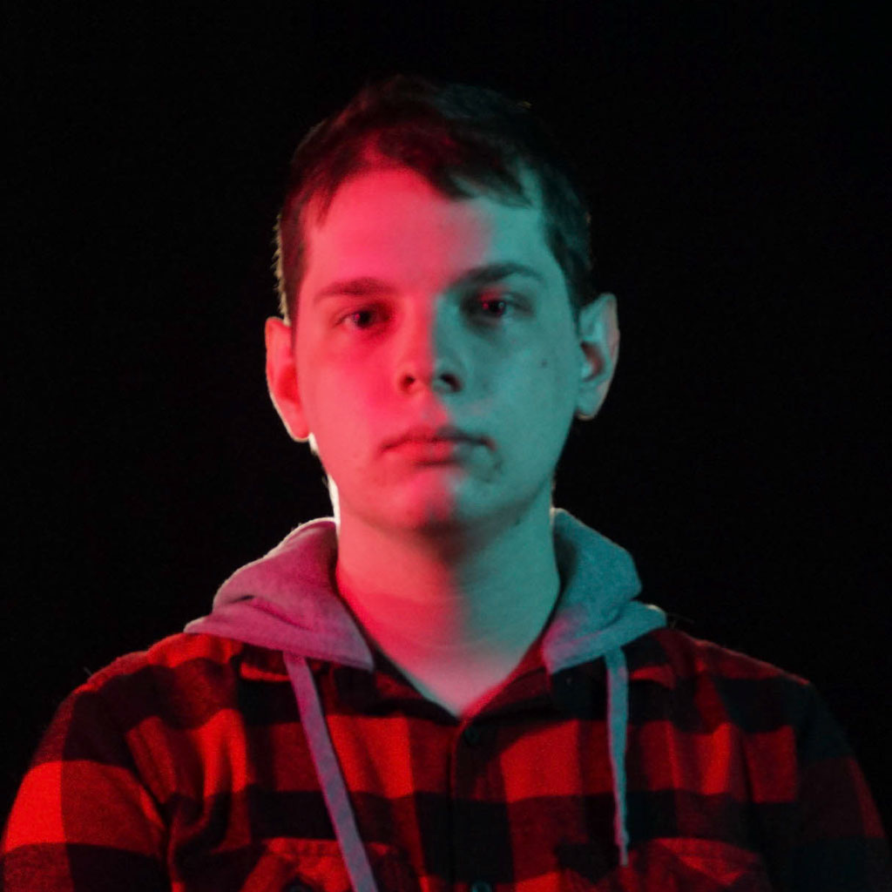

---

## 🎮 **Réalisations**

### 🗓 **Semaine 1** : Création des Sprites Sheets

- **Personnages & Ennemis**  
  Conception des sprites sheets pour les personnages et ennemis du jeu.

  - **Mage**  
    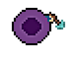  
    

  - **Paladin**  
    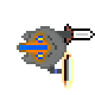  
    

  - **Archer**  
    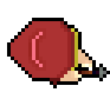  
    

  - **Mouche**  
    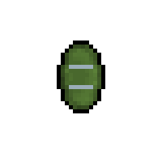  
    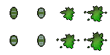

  - **Skeleton**  
    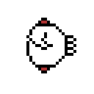  
    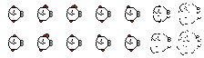

---

### 🗓 **Semaine 2** : Démo Unity & Nouveaux Sprite Sheets

- **Démo Unity**  
  Développement d'une démo interactive dans Unity permettant de déplacer un personnage et de créer des spawners pour les ennemis qui suivent le joueur.  
  Plusieurs scripts pour le jeu complétés.

  - **Scripts**  
    - **Health Controller**  
      ```csharp
      // Your Health Controller script code...
      ```

    - **Enemy Spawner**  
      ```csharp
      // Your EnemySpawner script code...
      ```

- **Nouveaux Sprite Sheets**  
  Création de nouveaux sprites sheets + animations pour enrichir l’univers du jeu, incluant des ennemis supplémentaires et des items à récupérer.

  - **Potion de Régénération**  
      
    

  - **Potion d'Invincibilité**  
      
    

  - **Bouclier**  
      
    

  - **Slimes**  
    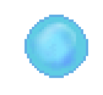  
    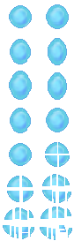

---

### 🗓 **Semaine 3** : Avancement du Gameplay & Modélisation Blender

- **Développement du Gameplay**  
  Amélioration du code du gameplay dans Unity avec de nouvelles mécaniques, améliorant ainsi l’expérience de jeu.
  - Développement d'un UI pour le jeu
  - Sprite Sheet pour coeur

- **Modélisation des Figurines**  
  Début du travail de modélisation 3D des figurines dans Blender pour ajouter un aspect visuel plus immersif au jeu.  
  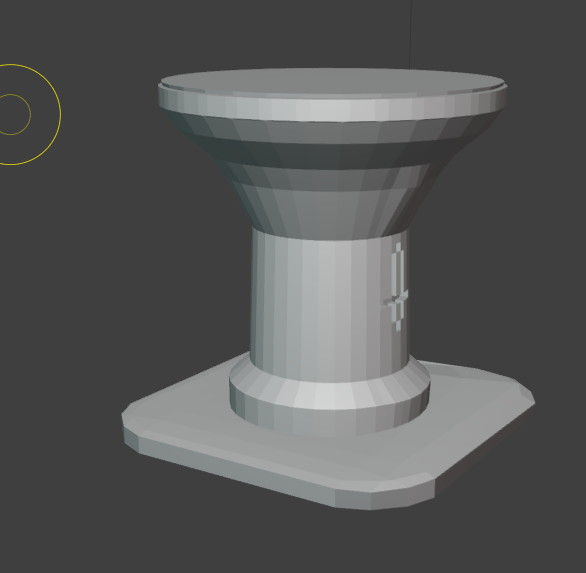

---

### 🗓 **Semaine 4** : Commencer à faire un concept de modèle 3D et travail supplémentaire sur les scripts du jeu

- **Animations des Ennemis**  
  Travail sur les animations des ennemis pour renforcer leur fluidité et leur comportement en jeu.

- **Animations des Personnages**  
  Conception d'animations pour les personnages jouables afin d'améliorer leur réactivité.

---

### 🗓 **Semaine 5** : Création de Powerups et Buff Abilities

- **Amélioration des attributs du personnage**  
  Ajout de 4 améliorations :
  - **Régénération de vie du crystal**  
    ```csharp
    // Your health script code...
    ```

  - **Amélioration de la vitesse**  
    ```csharp
    // Your speed buff script code...
    ```

  - **Bouclier**  
    ```csharp
    // Your shield buff script code...
    ```

  - **Amélioration des dégâts**  
    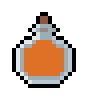  
    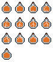

  - **Démonstration des Powerups**  
    

---

### 🗓 **Semaine 6** : Création de Nouveaux Variants d'Ennemis + Boss Final

- **Demon Skelette**  
  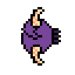  
  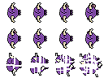

- **Chauve-Souris**  
    
  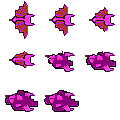

- **Slime Mauve**  
  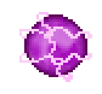  
  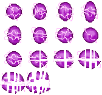

- **Demon (Boss Final)**  
  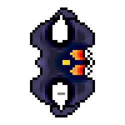  
  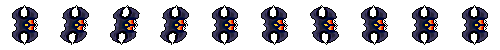

- **Création des boîtes items**  
  - Les boîtes spawnent pendant les vagues.

  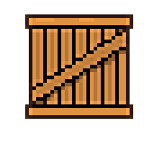

---

### 🗓 **Semaine 7** : Travail des vagues 9 et 10 (vague finale)

- **travail sur la 9e vague**

---

### 🏆 **Mon travail en images**

  
*Extrait de la démo Unity où le personnage interagit avec l’environnement et les ennemis.*
