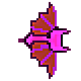

# Pierre-Luc Proulx


---

## 🎮 **Réalisations**

### 🗓 **Semaine 1** : Création des Sprites Sheets

- **Personnages & Ennemis**  
  Conception des sprites sheets pour les personnages et ennemis du jeu.

  - **Mage**  
      
    

  - **Paladin**  
      
    

  - **Archer**  
      
    

  - **Mouche**  
      
    

  - **Skeleton**  
      
    

---

### 🗓 **Semaine 2** : Démo Unity & Nouveaux Sprite Sheets

- **Démo Unity**  
  Développement d'une démo interactive dans Unity permettant de déplacer un personnage et de créer des spawners pour les ennemis qui suivent le joueur.  
  Plusieurs scripts pour le jeu complétés.

  - **Scripts**  
    - **Health Controller**  
      ```csharp
      // Your Health Controller script code...
      ```

    - **Enemy Spawner**  
      ```csharp
      // Your EnemySpawner script code...
      ```

- **Nouveaux Sprite Sheets**  
  Création de nouveaux sprites sheets + animations pour enrichir l’univers du jeu, incluant des ennemis supplémentaires et des items à récupérer.

  - **Potion de Régénération**  
      
    

  - **Potion d'Invincibilité**  
      
    

  - **Bouclier**  
      
    

  - **Slimes**  
      
    

---

### 🗓 **Semaine 3** : Avancement du Gameplay & Modélisation Blender

- **Développement du Gameplay**  
  Amélioration du code du gameplay dans Unity avec de nouvelles mécaniques, améliorant ainsi l’expérience de jeu.
  - Développement d'un UI pour le jeu
  - Sprite Sheet pour coeur

- **Modélisation des Figurines**  
  Début du travail de modélisation 3D des figurines dans Blender pour ajouter un aspect visuel plus immersif au jeu.  
  

---

### 🗓 **Semaine 4** : Commencer à faire un concept de modèle 3D et travail supplémentaire sur les scripts du jeu

- **Animations des Ennemis**  
  Travail sur les animations des ennemis pour renforcer leur fluidité et leur comportement en jeu.

- **Animations des Personnages**  
  Conception d'animations pour les personnages jouables afin d'améliorer leur réactivité.

---

### 🗓 **Semaine 5** : Création de Powerups et Buff Abilities

- **Amélioration des attributs du personnage**  
  Ajout de 4 améliorations :
  - **Régénération de vie du crystal**
    
  ```csharp
   using UnityEngine;
  [CreateAssetMenu(menuName = "Powerups/Health Buff")]
  public class HealthBuff : PowerUpEffect
  {
    public float healthRegenAmount = 50f; // Total health to regenerate
    public float healthRegenDuration = 5f;    // Duration of the regeneration effect
    public GameObject animationPrefab; // Reference to the animation prefab (e.g., a particle system)

    public Vector3 animationOffset = new Vector3(0f, 1f, 0f); // Offset for animation position relative to the crystal
    public float animationDuration = 2f; // Duration before the animation prefab is destroyed

    public override void Apply(GameObject target)
    {
        // Find all game objects with the "Crystal" tag
        GameObject[] crystals = GameObject.FindGameObjectsWithTag("Crystal");

        // Loop through all crystals and apply the health regeneration buff
        foreach (GameObject crystal in crystals)
        {
            // Get the HealthController component of the crystal
            HealthController crystalHealthController = crystal.GetComponent<HealthController>();

            if (crystalHealthController != null)
            {
                // Log health regen for each crystal
                Debug.Log("Applying health regen to crystal: " + crystal.name);

                
                crystalHealthController.StartRegeneratingHealth(healthRegenAmount, healthRegenDuration);

                // Instantiate the animation prefab at the crystal's position with an offset
                if (animationPrefab != null)
                {
                    // Calculate the position with offset relative to the crystal's position
                    Vector3 animationPosition = crystal.transform.position + animationOffset;

                    // Instantiate the animation prefab at the calculated position and rotation
                    GameObject animationObject = Instantiate(animationPrefab, animationPosition, crystal.transform.rotation);

                    // Optionally, destroy the animation prefab after a certain time (for particle systems or animations)
                    Destroy(animationObject, animationDuration);
                }
                else
                {
                    Debug.LogWarning("No animation prefab assigned to HealthBuff.");
                }
            }
            else
            {
                Debug.LogWarning("Crystal does not have a HealthController component attached.");
            }
        }
    }

    ```

  - **Amélioration de la vitesse**  
    ```csharp
    using System.Collections;
    using System.Collections.Generic;
    using UnityEngine;
    [CreateAssetMenu(menuName = "Powerups/SpeedBuff")]
    public class SpeedBuff : PowerUpEffect
    {
    public float amount; // The amount by which to decrease the player's shooting time
    public GameObject pickupAnimationPrefab; // The prefab of the pickup animation

    public override void Apply(GameObject target)
    {
        if (target == null)
        {
            Debug.LogError("Target is null. Make sure you're passing the player GameObject.");
            return;
        }

        // Apply the effect to the PlayerShoot component
        PlayerShoot playerShoot = target.GetComponent<PlayerShoot>();
        if (playerShoot != null)
        {
            // Decrease the time between shots to make shooting faster
            playerShoot._timeBetweenShots -= amount;

            // Ensure the time between shots doesn't go below a minimum threshold (e.g., 0.1 seconds)
            playerShoot._timeBetweenShots = Mathf.Max(playerShoot._timeBetweenShots, 0.1f);
        }

        // Now, use the `target` GameObject directly
        if (target != null)
        {
            // Find the child GameObject with the SpriteRenderer (assumed to be named "JoueurSprite")
            Transform joueurSpriteTransform = target.transform.Find("JoueurSprite");

            if (joueurSpriteTransform != null)
            {
                // Change the color of the SpriteRenderer to blue
                SpriteRenderer spriteRenderer = joueurSpriteTransform.GetComponent<SpriteRenderer>();
                if (spriteRenderer != null)
                {
                    spriteRenderer.color = Color.blue;
                    Debug.Log("JoueurSprite color changed to blue.");
                }
                else
                {
                    Debug.LogWarning("SpriteRenderer not found on JoueurSprite.");
                }

                // Speed up the animation by modifying the Animator's speed
                Animator spriteAnimator = joueurSpriteTransform.GetComponent<Animator>(); // Get the Animator from JoueurSprite
                if (spriteAnimator != null)
                {
                    spriteAnimator.speed += amount; // You can adjust this logic as needed
                    Debug.Log("JoueurSprite Animator speed modified.");
                }
                else
                {
                    Debug.LogWarning("Animator not found on JoueurSprite.");
                }
            }
            else
            {
                Debug.LogWarning("JoueurSprite child not found.");
            }

            // Instantiate the pickup animation prefab at the target's position
            if (pickupAnimationPrefab != null)
            {
                GameObject animationInstance = GameObject.Instantiate(pickupAnimationPrefab, target.transform.position, Quaternion.identity);

                // Make the animation follow the target's position
                animationInstance.transform.SetParent(target.transform); // Set the target as the parent of the animation object

                // Optionally, adjust the position relative to the target if needed, e.g., slightly above the target
                animationInstance.transform.localPosition = new Vector3(0, 1, 0); // Adjust as necessary

                // Destroy the animation after 2 seconds
                GameObject.Destroy(animationInstance, 2f);
            }
        }
    }
    }

    ```

  - **Bouclier**  
    ```csharp
    using UnityEngine;
    [CreateAssetMenu(fileName = "New Shield Buff", menuName = "Powerups/Shield Buff")]
    public class ShieldBuff : PowerUpEffect
    {
    public GameObject shieldPrefab; // The shield prefab that will appear on the player and Crystal
    private GameObject playerShield;
    private GameObject crystalShield;
    private float shieldDuration = 10f; // Duration for the shield to last
    private float playerShieldTimer = 0f;
    private float crystalShieldTimer;

    private float timeTilShieldStop = 10f;
    private float timeWhenShieldStop;

    // Offset for the player's shield position
    public Vector3 playerShieldOffset = new Vector3(0f, 1f, 0f);
    public Vector3 crystalShieldOffset = Vector3.zero; // Allow customization of crystal shield offset

    // Events for when the shield expires (optional)
    public delegate void ShieldExpired(GameObject shield);
    public event ShieldExpired OnShieldExpired;

    public override void Apply(GameObject target)
    {
        // Ensure the target is not null
        if (target == null) return;

        // Find the Crystal object in the scene
        GameObject crystal = GameObject.FindGameObjectWithTag("Crystal");

        // Check if the player already has a shield to prevent multiple shields
        if (playerShield != null)
        {
            Debug.Log("Player shield already applied, destroying previous shield.");
            DestroyShield(playerShield); // Remove the previous shield if it exists
        }

        // Instantiate the shield prefab at the player's position
        Debug.Log("Applying shield buff to player: " + target.name);
        playerShield = Instantiate(shieldPrefab, target.transform.position, Quaternion.identity);
        playerShield.transform.SetParent(target.transform); // Make the shield follow the player

        // Log when the shield is instantiated
        Debug.Log("Player shield spawned at position: " + target.transform.position);

        // Add ShieldScaler component to handle the scaling for the player
        ShieldScaler shieldScaler = playerShield.AddComponent<ShieldScaler>();
        shieldScaler.scaleDuration = 0.6f;
        shieldScaler.targetScale = new Vector3(1.3f, 1.3f, 1.3f);
        shieldScaler.initialScale = new Vector3(0.1f, 0.1f, 0.1f);

        // Apply the shield to the crystal (if it exists)
        if (crystal != null)
        {
            if (crystalShield != null)
            {
                Debug.Log("Crystal shield already applied, destroying previous shield.");
                DestroyShield(crystalShield); // Remove the previous shield on the Crystal
            }

            crystalShield = Instantiate(shieldPrefab, crystal.transform.position, Quaternion.identity);
            crystalShield.transform.SetParent(crystal.transform); // Make the shield follow the crystal

            // Log when the crystal shield is instantiated
            Debug.Log("Crystal shield spawned at position: " + crystal.transform.position);

            // Add ShieldScaler component to handle the scaling for the crystal
            ShieldScaler crystalShieldScaler = crystalShield.AddComponent<ShieldScaler>();
            crystalShieldScaler.scaleDuration = 0.6f;
            crystalShieldScaler.targetScale = new Vector3(0.6f, 0.6f, 0.6f);
            crystalShieldScaler.initialScale = new Vector3(0.1f, 0.1f, 0.1f);
        }

        // Start the shield timers for both shields
        playerShieldTimer = shieldDuration;
        crystalShieldTimer = shieldDuration;

        // Log the start of the shield duration
        Debug.Log("Player shield duration set to: " + playerShieldTimer + " seconds.");
        Debug.Log("Crystal shield duration set to: " + crystalShieldTimer + " seconds.");

        // Add Collider2D component to detect enemy collisions (ensure shield prefab has a collider)
        CircleCollider2D playerCollider = playerShield.GetComponent<CircleCollider2D>();
        if (playerCollider == null)
        {
            playerCollider = playerShield.AddComponent<CircleCollider2D>(); // Example, change to your preferred collider
            playerCollider.isTrigger = true; // Make sure it's a trigger
        }

        // Add collider to crystal shield
        if (crystal != null)
        {
            CircleCollider2D crystalCollider = crystalShield.GetComponent<CircleCollider2D>();
            if (crystalCollider == null)
            {
                crystalCollider = crystalShield.AddComponent<CircleCollider2D>(); // Example, change to your preferred collider
                crystalCollider.isTrigger = true; // Make sure it's a trigger
            }
        }
    }

    public void Start()
    {
        timeWhenShieldStop = Time.time + timeTilShieldStop;
    }

    public void Update()
    {
        // Update shield timers only when necessary
        if (playerShield != null)
        {
            playerShield.transform.position = playerShield.transform.parent.position + playerShieldOffset;

            // Reduce player shield timer
            playerShieldTimer -= Time.deltaTime;
            if (playerShieldTimer <= 0f)
            {
                DestroyShield(playerShield);
            }
        }

        if (crystalShield != null)
        {
            crystalShield.transform.position = crystalShield.transform.parent.position + crystalShieldOffset;

            // Reduce crystal shield timer
            crystalShieldTimer -= Time.deltaTime;
            if (crystalShieldTimer <= 0f)
            {
                DestroyShield(crystalShield);
            }
        }

        timeTilShieldStop -= Time.deltaTime;
        if (timeTilShieldStop <= 0f)
        {
            DestroyShield(crystalShield); // Destroy the crystal shield after the powerup duration ends
        }

        // Check if the shield duration has ended and destroy the scriptable object
        if (playerShieldTimer <= 0f && crystalShieldTimer <= 0f)
        {
            Destroy(this);  // Destroy the ScriptableObject itself
            Debug.Log("Shield Buff has expired and ScriptableObject is destroyed.");
        }
    }

    public void OnTriggerEnter(Collider other)
    {
        // Check if the collider that touched the shield has the "ennemie" tag
        if (other.CompareTag("ennemie"))
        {
            Debug.Log("Enemy touched the shield. Destroying both shields.");
            DestroyShield(playerShield);
            DestroyShield(crystalShield); // Destroy shields when an enemy touches them
        }
    }

    private void DestroyShield(GameObject shield)
    {
        if (shield != null)
        {
            // Optionally, invoke a callback if there are listeners
            OnShieldExpired?.Invoke(shield);

            Destroy(shield); // Destroy the shield
            Debug.Log("Shield destroyed.");
        }
    }

    public void SetShieldTimer(float newTime)
    {
        shieldDuration = newTime; // Set the new shield duration
        playerShieldTimer = newTime; // Apply to the player shield timer
        crystalShieldTimer = newTime; // Apply to the crystal shield timer
        Debug.Log("Shield timer updated to: " + newTime);
    }
    }

    ```

  - **Amélioration des dégâts**  
      
    

  - **Démonstration des Powerups**  
    

---

### 🗓 **Semaine 6** : Création de Nouveaux Variants d'Ennemis + Boss Final

- **Demon Skelette**  
    
  

- **Chauve-Souris**  
    
  

- **Slime Mauve**  
    
  

- **Demon (Boss Final)**  
    
  

- **Création des boîtes items**  
  - Les boîtes spawnent pendant les vagues.

  

---

### 🗓 **Semaine 7** : Travail des vagues 9 et 10 (vague finale)

- **Travail sur la 9e vague**
- **Travail sur la 10e vague**
   

- **Travailler sur des scripts sur le boss et ses comportements sur scène**

#### Mouvement du boss

```csharp
using UnityEngine;

public class BossMovement : MonoBehaviour
{
    public string targetTag = "Crystal";  // Tag of the target (e.g., the crystal)
    public string obstacleTag = "Box";  // Tag of the obstacle (Box)
    public string obstacleCoffreTag = "BoiteEvenement";
    public float moveSpeed = 3f;  // Speed at which the boss moves
    public float obstacleDetectionRange = 2f;  // Range to detect obstacles ahead
    public float avoidanceStrength = 3f;  // Strength of the avoidance (how much it will move around the obstacle)
    public float backUpDistance = 2f;  // Distance to back up when colliding with the crystal
    public float backUpDuration = 1f;  // Duration for the backup movement
    public float circleRadius = 5f; // Radius around the crystal that the boss will move in
    public float circleSpeed = 1f; // Speed at which the boss moves around the crystal
    public float verticalAvoidanceDistance = 5f; // The height at which the boss will move to avoid the box

    private Transform target;  // The target the boss is moving towards (e.g., the crystal)
    private bool isCollidingWithBox = false;  // Flag to check if the boss collided with the Box
    private bool hasTeleported = false;  // Flag to check if the boss has already teleported
    private bool isBackingUp = false;  // Flag to check if the boss is backing up after hitting the crystal
    private float backUpTimer = 0f;  // Timer to control the backup duration

    private void Start()
    {
        // Find the GameObject with the "Crystal" tag and get its transform
        GameObject crystal = GameObject.FindGameObjectWithTag(targetTag);
        if (crystal != null)
        {
            target = crystal.transform;  // Set the target to the crystal's position
        }
        else
        {
            Debug.LogWarning("No GameObject with the 'Crystal' tag found!");
        }
    }

    private void Update()
    {
        if (isCollidingWithBox && !hasTeleported)
        {
            // Boss is colliding with the Box, stop shooting and teleport only if it hasn't teleported already
            StopShootingFireballs();
            TeleportToRandomSide();
            hasTeleported = true;  // Set flag to prevent teleporting again until the next collision
            return; // Prevent the boss from moving towards the target or detecting obstacles
        }

        // If a target exists, move around it while keeping a distance
        if (target != null)
        {
            MoveAroundTarget();
        }
    }

    void MoveAroundTarget()
    {
        // Get the direction to the target (crystal)
        Vector3 directionToTarget = target.position - transform.position;

        // Calculate the distance from the boss to the target (crystal)
        float distanceToTarget = directionToTarget.magnitude;

        // If the boss is too close to the crystal, move back slightly to maintain the desired distance
        if (distanceToTarget < circleRadius)
        {
            // Move away from the target to maintain distance
            Vector3 moveDirection = directionToTarget.normalized;
            transform.Translate(-moveDirection * moveSpeed * Time.deltaTime, Space.World);
        }
        else
        {
            // Otherwise, move around the target in a circular path, keeping the desired radius
            Vector3 perpendicularDirection = Vector3.Cross(directionToTarget, Vector3.forward).normalized;

            // Move in a circle around the target, maintaining the desired distance
            transform.Translate(perpendicularDirection * circleSpeed * Time.deltaTime, Space.World);
        }

        // Keep facing the crystal while moving
        Vector3 directionToFace = target.position - transform.position;
        float angle = Mathf.Atan2(directionToFace.y, directionToFace.x) * Mathf.Rad2Deg;
        transform.rotation = Quaternion.Euler(new Vector3(0, 0, angle));
    }

    // Method to stop shooting fireballs (called when the boss collides with the "Box")
    void StopShootingFireballs()
    {
        // Get the Boss script attached to the same GameObject as this BossMovement script
        Boss bossScript = GetComponent<Boss>();
        if (bossScript != null)
        {
            bossScript.SetShootingEnabled(false);  // Call the new method to disable shooting
        }
    }

    // Method to teleport the boss to a random side of the screen
    void TeleportToRandomSide()
    {
        // Determine random screen side (left, right, top, or bottom)
        float screenWidth = Screen.width;
        float screenHeight = Screen.height;

        // Convert screen coordinates to world coordinates
        Vector2 randomPosition = Vector2.zero;
        int side = Random.Range(0, 4);

        // Randomly pick a side to teleport to
        switch (side)
        {
            case 0: // Left side
                randomPosition = Camera.main.ScreenToWorldPoint(new Vector2(0, Random.Range(0, screenHeight)));
                break;
            case 1: // Right side
                randomPosition = Camera.main.ScreenToWorldPoint(new Vector2(screenWidth, Random.Range(0, screenHeight)));
                break;
            case 2: // Top side
                randomPosition = Camera.main.ScreenToWorldPoint(new Vector2(Random.Range(0, screenWidth), screenHeight));
                break;
            case 3: // Bottom side
                randomPosition = Camera.main.ScreenToWorldPoint(new Vector2(Random.Range(0, screenWidth), 0));
                break;
        }

        // Set the boss's position to the random position on the chosen side
        transform.position = randomPosition;
    }

    // Method to handle collision with Box (called when collision occurs)
    private void OnCollisionEnter2D(Collision2D collision)
    {
        if (collision.gameObject.CompareTag(obstacleTag) || collision.gameObject.CompareTag(obstacleCoffreTag))
        {
            // Boss collided with a Box, stop shooting, teleport and prevent multiple teleports
            isCollidingWithBox = true;
        }

        if (collision.gameObject.CompareTag(targetTag))
        {
            // Boss collided with the Crystal, teleport away
            TeleportToRandomSide();
        }
    }

    // Reset the teleport flag when the boss exits the collision
    private void OnCollisionExit2D(Collision2D collision)
    {
        if (collision.gameObject.CompareTag(obstacleTag))
        {
            // Boss has exited the box collision, allow teleport again when next collision happens
            isCollidingWithBox = false;
            hasTeleported = false;  // Allow teleportation on the next collision
        }

        if (collision.gameObject.CompareTag(targetTag))
        {
            // Reset backup behavior after leaving the crystal
            isBackingUp = false;
        }
    }
}

```


---

### 🏆 **Mon travail en images**

  
*Extrait de la démo Unity où le personnage interagit avec l’environnement et les ennemis.*
