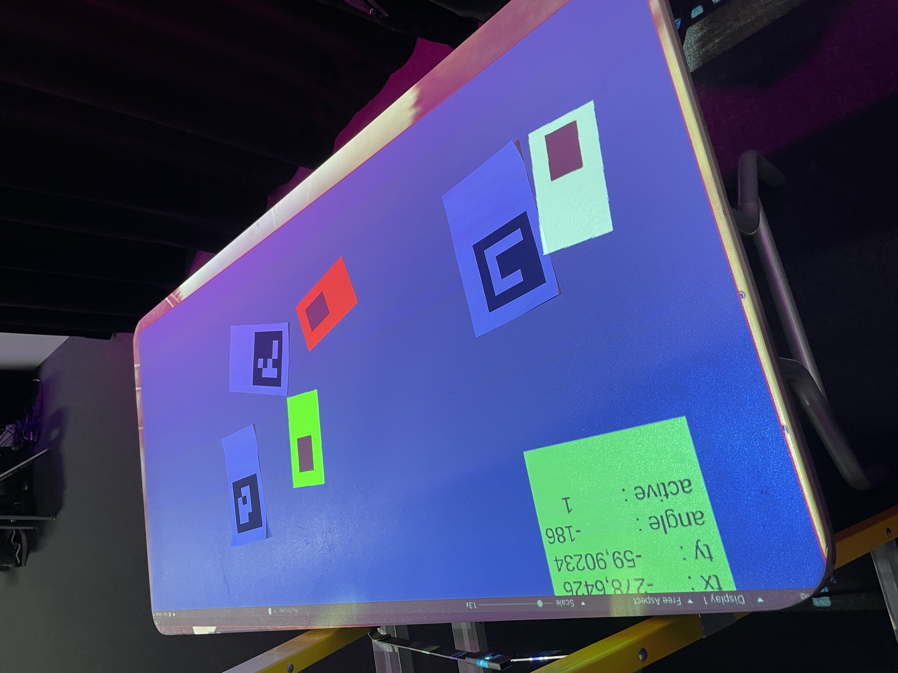
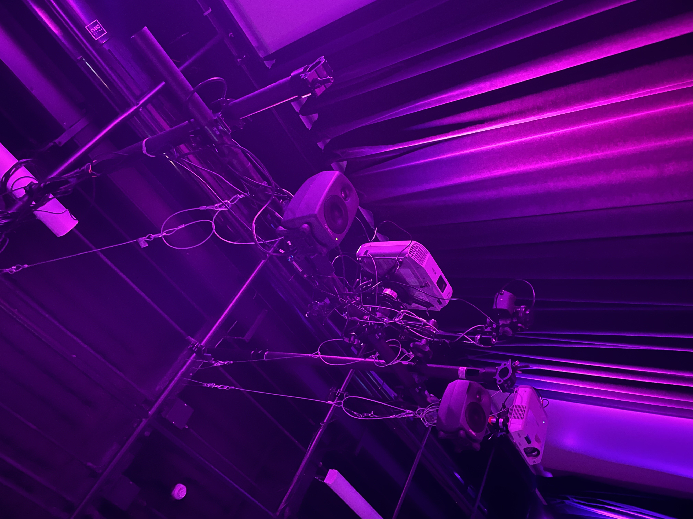
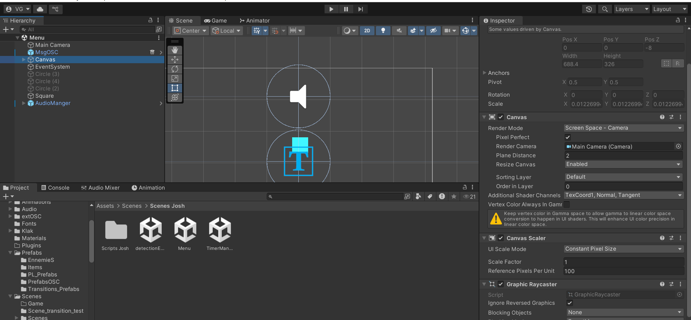
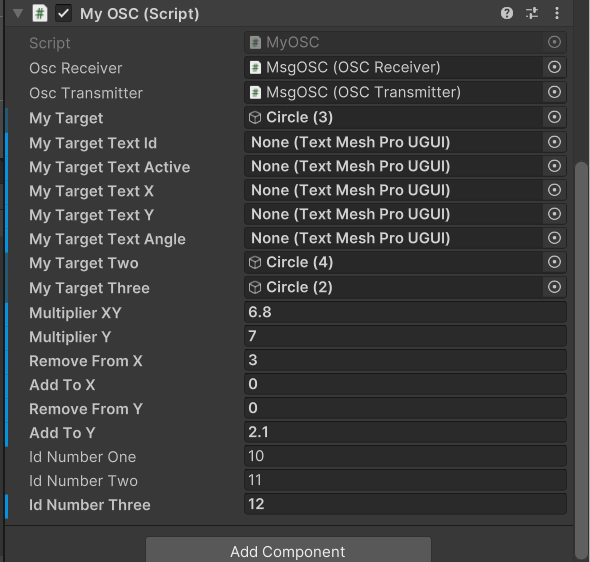

# Victor Gileau

<!---->


## Réalisations

 <!-- Une image par semaine de la réalisation dont tu es le plus fier avec une légende -->

### Semaine 1 :

Ma réalisation de cette semaine est d’avoir complété et compris le [tutoriel](https://www.youtube.com/watch?v=oaHM6CtlqQY&t=1s) pour la détection de code **[ArUco](https://docs.opencv.org/4.x/d5/dae/tutorial_aruco_detection.html)** dans **[TouchDesigner](https://derivative.ca)**.

Tutoriel par [Scott Allen Visual Art](https://www.youtube.com/@ScottAllenvis)

[](https://www.youtube.com/watch?v=oaHM6CtlqQY)

Première itération (2025-01-24) :


---

### Semaine 2 :


Ma réalisation cette semaine est de réussir à recevoir et utiliser les données envoyées par **[TouchDesigner](https://derivative.ca)** dans **[Unity](https://unity.com)**.

En utilisant un script en C# avec l'aide de l'extension ["**extOSC**"](https://github.com/Iam1337/extOSC). Je me suis aussi beaucoup fier à la documentation de **[Thomas Ouellet Fredericks](https://t-o-f.info/m5_docs/#/unity/extosc/README)**.

J'ai aussi utilisé le code de [Jacob Alarie Brousseau](https://github.com/Les-gars-d-la-table/Canevas-Cosmique/blob/main/docs/journaux/alariebrousseau_jacob_journal.md) pour le code qui calcule l'angle (plus de détails dans cette ["issus"](https://github.com/Ethereal-Creators/Etheria/issues/5)).

Dans Unity (2025-01-29) :

[](https://www.youtube.com/watch?v=-zSgB_mS-zw)

Dans TouchDesigner (2025-01-29) :


---

### Semaine 3 :

Utilisation de l'installation compéter en équipe pour le test du prototype avec [OSC](https://en.wikipedia.org/wiki/Open_Sound_Control) sur **[Unity](https://unity.com)** avec la librairie ["**extOSC**"](https://github.com/Iam1337/extOSC). Le test était fonctionnel et permis à la modification des données pour une bonne transmission des données dans **[Unity](https://unity.com)**.

Dans Unity (2025-02-06) :



Installation réalisée en équipe qui faisait la projection (n'est pas ma réalisation seulement pour mieux visualiser) (2025-02-06):



---

### Semaine 4 :

Ajout d'un script [*"winScript"*](https://github.com/Ethereal-Creators/EtheriaKingdom_Uni/blob/main/Etheria_Kingdom/Assets/Scripts/winScript.cs) pour gagner la partie et un [*"failScript"*](https://github.com/Ethereal-Creators/EtheriaKingdom_Uni/blob/main/Etheria_Kingdom/Assets/Scripts/failScript.cs) pour réussir la partie. Permetant d'avoir un réussite et écheque possible pour le jeu.

#### Unity *"winObject"* :


#### [*"winScript"*](https://github.com/Ethereal-Creators/EtheriaKingdom_Uni/blob/main/Etheria_Kingdom/Assets/Scripts/winScript.cs) :
```c#
using System.Collections;
using System.Collections.Generic;
using UnityEngine;
using UnityEngine.Events;
using UnityEngine.SceneManagement;
using TMPro;
using UnityEditor.Rendering;

public class winScript : MonoBehaviour
{

    //private float timetest = 0.0f;
    public float timeTilSucces;
    private float timeWhenWin;

    public float timeTilChangeScene;
    private float timeWhenChangeScene;

    public GameObject crystalIsActive;
    public TextMeshProUGUI countDown;

    private float timeDown = 0.0f;
    private int currentTime = 0;

    private bool winSlowDown = false;

    [SerializeField] UnityEvent gameWin;

    // Start is called before the first frame update
    void Start()
    {
        timeWhenWin = Time.time + timeTilSucces;
        timeWhenChangeScene = Time.time + timeTilChangeScene;
    }

    // Update is called once per frame
    void Update()
    {
        timeDown += Time.deltaTime;
        if (timeDown >= 1f)
        {
            timeDown = 0.0f;
            currentTime++;
            countDown.text = currentTime.ToString();
        }

        //time += Time.deltaTime;
        //source du code : https://discussions.unity.com/t/how-to-check-if-object-is-active/116705
        if (timeWhenWin <= Time.time)
        {
            if (crystalIsActive != null)
            {
                winSlowDown = true;
                gameWin.Invoke();
                countDown.text = "Win";
            }
            timeWhenWin = Time.time + timeTilSucces;
        }
        if (winSlowDown == true)
        {
            timeTilChangeScene -= Time.deltaTime;
            if (timeTilChangeScene < 0)
            {
                // Permet de changer de scenes
                SceneManager.LoadScene("Menu");
                Debug.Log("Win return to start.");
            }
        }
    }
}
```

#### Unity *"failObject"* :


#### [*"failScript"*](https://github.com/Ethereal-Creators/EtheriaKingdom_Uni/blob/main/Etheria_Kingdom/Assets/Scripts/failScript.cs) :
```c#
using System.Collections;
using System.Collections.Generic;
using UnityEngine;
using UnityEngine.Events;
using UnityEngine.SceneManagement;
using TMPro;
using UnityEditor.Rendering;

public class failScript : MonoBehaviour
{

    public float timeTilFail;
    private float timeWhenFail;

    public GameObject crystalIsActive;
    public GameObject failPanel;

    public TextMeshProUGUI countDown;

    // POUR AJOUTER FAIL ===> public Animator failCountdown;

    [SerializeField] UnityEvent gameFail;
    // Start is called before the first frame update
    void Start()
    {
        timeWhenFail = Time.time + timeTilFail;
    }

    // Update is called once per frame
    void Update()
    {
        if (crystalIsActive == null && failPanel.activeSelf == true)
        {
            countDown.text = "Fail";
            timeTilFail -= Time.deltaTime;
            // POUR AJOUTER FAIL ===> failCountdown.SetBool("isFail", true);
            if (timeTilFail < 0)
            {
                gameFail.Invoke();
                SceneManager.LoadScene("Menu");
                Debug.Log("Fail return to start.");
                // POUR AJOUTER FAIL ===> failCountdown.SetBool("isFail", false);
            }
            /*if (timeWhenFail <= Time.time)
            {
                timeWhenFail = Time.time + timeTilFail;
            }*/
        }
    }
}
```

---

### Semaine 5 :

Correction demande du prof pour les canvas de les changer pour caméra space. Plus ajuster la grosseur de la caméra dans le menu pour être la même taille que dans la scène "test01_OSC".

Le changement vers un nouveau canvas a été difficile pour les deux scènes étant placées avec un autre canvas auparavant, presque tous les objets dans les scènes ont dû être déplacés ou édités.

#### Capture de chaque scenes :




#### Changer taille de la caméra pour le menu :




Le changement de taille permet d'éditer les données pour les *"tracker"* plus facilement. Ayant la même taille que dans la scène "test01_OSC".

---

### Semaine 6 :

Création d'un "préfab" pour instancier les *"prefabs"* (*"Box"*) de Pierre-Luc dans la scène un à la fois après un certain temps. Le script dans le *"prefab"* permet aussi de décider le nombre de *"Box"* qu'il peut y avoir en même temps et s'il y en a qui sont détruits, d'autres vont apparaître pour se rendre au maximum.

#### Images + Vidéos :


[](https://www.youtube.com/watch?v=js2z5s2INXw)

#### Code :

```c#
using System.Collections;
using System.Collections.Generic;
using UnityEngine;

public class spawnerItemsScript : MonoBehaviour
{
    public GameObject item;
    private float timeDown = 0.0f;

    private float timeCheck = 0.0f;

    public float minTimeUntilNextSpawn;

    public float maxTimeUntilNextSpawn;

    [Header("------- Max Spawn Item -------")]

    public int maxAmountOfItems = 3;

    public int currentItemsCount;

    [Header("------- Position Spawn Item -------")]

    public float minimumRandomX;
    public float maximumRandomX;
    public float minimumRandomY;
    public float maximumRandomY;

    [Header("------- Audio Effects Spawn Item -------")]
    public AudioSource source;
    public List<AudioClip> clipsStart = new List<AudioClip>();

    [Header("------- Spawned Item (do not add object) -------")]

    public List<GameObject> ListItems = new List<GameObject>();

    private bool setMaxItem = false;

    //healthPackClones.add(Instantiate(healthPack,healthPackSpawns[0].transform.position,healthPackSpawns[0].transform.rotation) as GameObject);

    // Start is called before the first frame update
    void Start()
    {
        source = this.gameObject.GetComponent<AudioSource>();
    }

    // Update is called once per frame
    void Update()
    {
        timeCheck += Time.deltaTime;
        if (timeCheck >= 0.5f)
        {
            timeCheck = 0.0f;

            for (int i = 0; i < ListItems.Count; i++)
            {
                if (ListItems[i] == null && setMaxItem == false /*&& maxAmountOfItems < currentItemsCount*/)
                {
                    ListItems.RemoveAll(item => item.gameObject == null);
                    currentItemsCount = currentItemsCount - 1;
                    setMaxItem = true;
                }
            }
        }

        float randomValue = Random.Range(minTimeUntilNextSpawn, maxTimeUntilNextSpawn);
        timeDown += Time.deltaTime;
        if (timeDown >= randomValue)
        {
            timeDown = 0.0f;

            if (maxAmountOfItems > currentItemsCount)
            {
                if (setMaxItem == true)
                {
                    setMaxItem = false;
                }
                currentItemsCount++;
                //ListItems.add(Instantiate(item, (new Vector2(Random.Range(minimumRandomX, maximumRandomX), Random.Range(minimumRandomY, maximumRandomY))), Quaternion.identity));

                GameObject newItem = Instantiate(item, (new Vector2(Random.Range(minimumRandomX, maximumRandomX), Random.Range(minimumRandomY, maximumRandomY))), Quaternion.identity);
                ListItems.Add(newItem);
            }


            if (source != null && clipsStart.Count > 0)
            {
                int randomClipIndex = Random.Range(0, clipsStart.Count);
                source.PlayOneShot(clipsStart[randomClipIndex]);
            }


            //countDown.text = currentTime.ToString();  // Removed
        }
    }
}
```

Création de *"prefab"* qui est un coffre ou boite qui va contenir les amélioration d'armes des joueurs. Ce *"prefab"* va détruitruire après un certain nombre de contacte avec des projectiles ce qui activera l'amélioration d'arme en arrière de celui-ci.

#### Image + Vidéo :


[](https://www.youtube.com/watch?v=N49hRGMHcVk)

#### Code dans script des projectile (ce trouve dans les *"OnCollisionEnter2D"*) :

Le *"prefab"* a le tag "BoiteEvenement".

```c#
if (collision.CompareTag("BoiteEvenement"))
{
    var scriptEvent = collision.gameObject.GetComponent<eventContainerScript>();
    scriptEvent.actionOnCollsion();  // Handle event-specific actions
}
```

#### Code script du prefab :

```c#
using System.Collections;
using System.Collections.Generic;
using UnityEngine;
using UnityEngine.Events;

public class eventContainerScript : MonoBehaviour
{

    public int maxAmountOfHit;
    public int totalOfHit;

    private float timeDown = 0.0f;

    public float frequecyOfCheckup;

    public GameObject sprite;

    public GameObject InfoCanvas;

    private bool isInfoCanvasActive = false;
    [SerializeField] UnityEvent actionOnDesepear;

    private bool isAnimationActive = false;

    public void Update()
    {

        timeDown += Time.deltaTime;
        if (timeDown >= frequecyOfCheckup)
        {
            timeDown = 0.0f;
            if (isAnimationActive == true)
            {
                sprite.gameObject.GetComponent<SpriteRenderer>().color = Color.red;
                isAnimationActive = false;
                Debug.Log("Red");
            }
            else if (isAnimationActive == false)
            {
                sprite.gameObject.GetComponent<SpriteRenderer>().color = Color.white;
                Debug.Log("White");
            }

            if (isInfoCanvasActive == true)
            {
                isInfoCanvasActive = false;
                InfoCanvas.SetActive(true);
            }
            else if (isInfoCanvasActive == false)
            {
                InfoCanvas.SetActive(false);
            }
        }
    }

    public void actionOnCollsion()
    {
        Debug.Log("Colided with 'BoiteEvenement'");
        totalOfHit++;
        isAnimationActive = true;

        isInfoCanvasActive = true;

        if (maxAmountOfHit <= totalOfHit)
        {
            actionOnDesepear.Invoke();
            this.gameObject.GetComponent<SpriteRenderer>().enabled = false;
            this.gameObject.GetComponent<BoxCollider2D>().enabled = false;
        }
    }

    public void OnCollisionEnter2D(Collision2D coll)
    {
        if (InfoCanvas != null)
        {
            if (InfoCanvas.gameObject.activeSelf == false)
            {
                InfoCanvas.SetActive(true);
            }
        }
    }

    public void OnCollisionExit2D(Collision2D coll)
    {
        if (InfoCanvas != null)
        {
            if (InfoCanvas.gameObject.activeSelf == true)
            {
                InfoCanvas.SetActive(false);
            }
        }
    }
}

```

---

### Semaine de rattrapage :

Création d'un script pour activer les "BoîteEvénement" une à la fois. Dans l'exemple ci-dessous, le premier apparaît après 7 secondes et les deux autres apparaissent après un nombre de secondes sélectionné au hasard entre 2 et 4 inclusivement. La liste d'objets est l'ordre dans lequel les objets sont activés. L'audio en dessous s'active à chaque activation d'objets.

#### Images + Vidéos :


[](https://www.youtube.com/watch?v=oPVOHdFCtOg)

#### Code (*"countDownUntilSpawn"*) :

```c#
using System.Collections;
using System.Collections.Generic;
using UnityEngine;
 
public class CountDownUntilSpawn : MonoBehaviour
{
 
    public float timeTilShowFirts;
    public float timeTilShowNextMin;
    public float timeTilShowNextMax;
 
    private bool isFirstDone = false;
 
    private float timeDown = 0.0f;
 
    [Header("------- Power Up Box -------")]
 
    public List<GameObject> ListPowerUpBox = new List<GameObject>();
 
    private int currentMaxSpawned = 0;
 
    [Header("------- Audio -------")]
 
    [SerializeField]
    private AudioSource source;
 
    public List<AudioClip> clips = new List<AudioClip>();
 
    //public GameObject[] ListPowerUpBox;
 
    // Update is called once per frame
    void Update()
    {
        timeDown += Time.deltaTime;
 
        if (isFirstDone == false)
        {
            ActivateEventBox(timeTilShowFirts);
        }
        if (isFirstDone == true)
        {
            float randomValue = Random.Range(timeTilShowNextMin, timeTilShowNextMax);
            ActivateEventBox(randomValue);
        }
 
    }
 
    private void ActivateEventBox(float timeTil)
    {
        if (timeDown >= timeTil)
        {
            if (isFirstDone == false)
            {
                isFirstDone = true;
            }
 
           
 
            timeDown = 0.0f;
            Debug.Log("hello number : " + currentMaxSpawned);
            if ((currentMaxSpawned + 1) <= ListPowerUpBox.Count)
            {
                if (ListPowerUpBox[currentMaxSpawned] != null)
                {
                    if (source != null && clips.Count > 0)
                    {
                        int randomClipIndex = Random.Range(0, clips.Count);
                        source.PlayOneShot(clips[randomClipIndex]);
                    }
 
                    ListPowerUpBox[currentMaxSpawned].SetActive(true);
                    currentMaxSpawned++;
                }
            }
        }
    }
}
```

#### Travail sur les scènes Unity :

* Correction de *"bug"*

* Ajout de fonds personnalisés

* Correction des sons

* Correction de *"prefabs"* (ex.: ennemi et *"eventStarter"*)


---

### Semaine 7 :

Création d'un script pour que les utilisateur place les joueurs au bonne endroit quand demander a la fin d'une partie ou a l'échque d'une partie.

#### Premier script :

Enclenche un deux événements différents, un pour quand le bon joueur entre en collision avec le l'objet avec le script et un autre pour quand il sort de l'objet. Un son différent est aussi enclenché à l'interaction pour avant chaque [événement Unity](https://docs.unity3d.com/6000.0/Documentation/ScriptReference/Events.UnityEvent.html).


```cs
using System.Collections;
using System.Collections.Generic;
using UnityEngine;
using UnityEngine.Events;
using UnityEngine.SceneManagement;
 
public class positionPlayerScript : MonoBehaviour
{
    public GameObject playerSelected;
 
    public UnityEvent OnPlaced;
 
    public UnityEvent OnLeave;
 
    [Header("------- Audio Effects -------")]
    [SerializeField]
    private AudioSource source;
 
    public List<AudioClip> clipsEnter = new List<AudioClip>();
 
    public List<AudioClip> clipsExit = new List<AudioClip>();
 
    private void OnCollisionEnter2D(Collision2D collision)
    {
        if (collision.gameObject == playerSelected.gameObject)
        {
            if (source != null && clipsEnter.Count > 0)
            {
                int randomClipIndex = Random.Range(0, clipsEnter.Count);
                source.PlayOneShot(clipsEnter[randomClipIndex]);
            }
            OnPlaced.Invoke();
            Debug.Log("Placer le " + collision.gameObject.name);
        }
    }
 
    private void OnCollisionExit2D(Collision2D collision)
    {
        if (collision.gameObject == playerSelected.gameObject)
        {
            if (source != null && clipsExit.Count > 0)
            {
                int randomClipIndex = Random.Range(0, clipsExit.Count);
                source.PlayOneShot(clipsExit[randomClipIndex]);
            }
            OnLeave.Invoke();
            Debug.Log("Enlever le " + collision.gameObject.name);
        }
    }
}
```

#### Deuxième script :

Va surveiller certaines valeurs, sont vraies ou fausses, et s'ils sont toutes vraies, enclencher un événement. Contient des fonctions qui sont des variables à vrai ou faux pour chaque joueur (x3).


```cs
using System.Collections;
using System.Collections.Generic;
using UnityEngine;
using UnityEngine.Events;
using UnityEngine.SceneManagement;
 
public class eventAllPlayerPlaced : MonoBehaviour
{
    [Header("------- Ne pas cocher (seulment pour visualiser) -------")]
    public bool isPlayerOnePlaced = false;
    public bool isPlayerTwoPlaced = false;
    public bool isPlayerThreePlaced = false;
 
    public float timeTilChangeScene; // Time until scene change
    private float timeWhenChangeScene;
 
    [SerializeField] UnityEvent actionAfterAnimation;
 
    private bool isActionAfterAnimationDone = false;
 
    void Start()
    {
        timeWhenChangeScene = Time.time + timeTilChangeScene;
    }
 
    // Update is called once per frame
    void Update()
    {
        if (isPlayerOnePlaced == true && isPlayerTwoPlaced == true && isPlayerThreePlaced == true)
        {
            actionAfterAnimation.Invoke();
        }
    }
 
    public void SetPlayerOnePlaced()
    {
        isPlayerOnePlaced = true;
    }
    public void SetPlayerTwoPlaced()
    {
        isPlayerTwoPlaced = true;
    }
    public void SetPlayerThreePlaced()
    {
        isPlayerThreePlaced = true;
    }
 
 
    public void SetPlayerOneRemoved()
    {
        isPlayerOnePlaced = false;
    }
    public void SetPlayerTwoRemoved()
    {
        isPlayerTwoPlaced = false;
    }
    public void SetPlayerThreeRemoved()
    {
        isPlayerThreePlaced = false;
    }
}
```

#### Exemple vidéo :

[](https://www.youtube.com/watch?v=UENdedOVX6g)


<!--* -->
