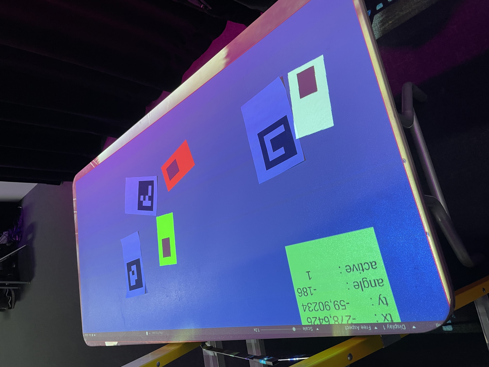
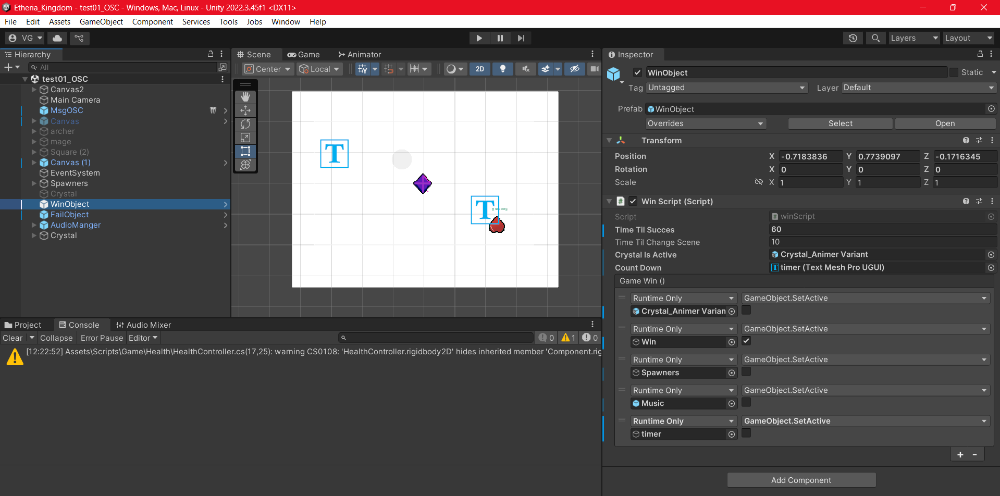
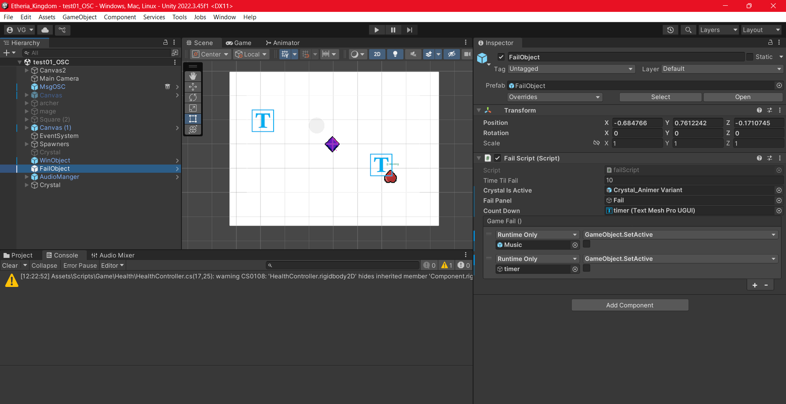
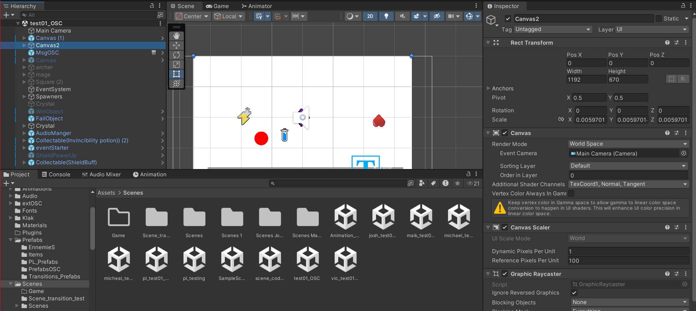
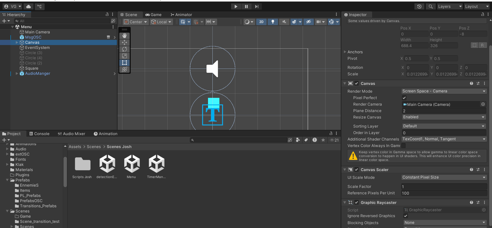
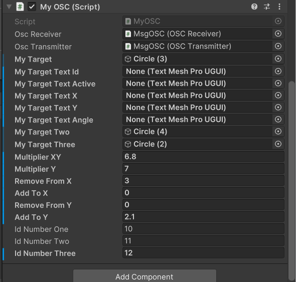
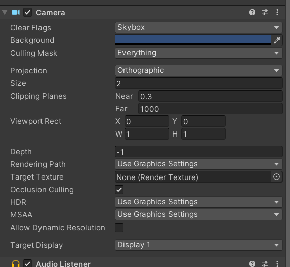

# Victor Gileau

<!---->


## Réalisations

 <!-- Une image par semaine de la réalisation dont tu es le plus fier avec une légende -->

### Semaine 1 :

Ma réalisation de cette semaine est d’avoir complété et compris le [tutoriel](https://www.youtube.com/watch?v=oaHM6CtlqQY&t=1s) pour la détection de code **[ArUco](https://docs.opencv.org/4.x/d5/dae/tutorial_aruco_detection.html)** dans **[TouchDesigner](https://derivative.ca)**.

Tutoriel par [Scott Allen Visual Art](https://www.youtube.com/@ScottAllenvis)

[](https://www.youtube.com/watch?v=oaHM6CtlqQY)

Première itération (2025-01-24) :


---

### Semaine 2 :


Ma réalisation cette semaine est de réussir à recevoir et utiliser les données envoyées par **[TouchDesigner](https://derivative.ca)** dans **[Unity](https://unity.com)**.

En utilisant un script en C# avec l'aide de l'extension ["**extOSC**"](https://github.com/Iam1337/extOSC). Je me suis aussi beaucoup fier à la documentation de **[Thomas Ouellet Fredericks](https://t-o-f.info/m5_docs/#/unity/extosc/README)**.

J'ai aussi utilisé le code de [Jacob Alarie Brousseau](https://github.com/Les-gars-d-la-table/Canevas-Cosmique/blob/main/docs/journaux/alariebrousseau_jacob_journal.md) pour le code qui calcule l'angle (plus de détails dans cette ["issus"](https://github.com/Ethereal-Creators/Etheria/issues/5)).

Dans Unity (2025-01-29) :

[](https://www.youtube.com/watch?v=-zSgB_mS-zw)

Dans TouchDesigner (2025-01-29) :


---

### Semaine 3 :

Utilisation de l'installation compéter en équipe pour le test du prototype avec [OSC](https://en.wikipedia.org/wiki/Open_Sound_Control) sur **[Unity](https://unity.com)** avec la librairie ["**extOSC**"](https://github.com/Iam1337/extOSC). Le test était fonctionnel et permis à la modification des données pour une bonne transmission des données dans **[Unity](https://unity.com)**.

Dans Unity (2025-02-06) :



Installation réalisée en équipe qui faisait la projection (n'est pas ma réalisation seulement pour mieux visualiser) (2025-02-06):


---

### Semaine 4 :

Ajout d'un script [*"winScript"*](https://github.com/Ethereal-Creators/EtheriaKingdom_Uni/blob/main/Etheria_Kingdom/Assets/Scripts/winScript.cs) pour gagner la partie et un [*"failScript"*](https://github.com/Ethereal-Creators/EtheriaKingdom_Uni/blob/main/Etheria_Kingdom/Assets/Scripts/failScript.cs) pour réussir la partie. Permetant d'avoir un réussite et écheque possible pour le jeu.

#### Unity *"winObject"* :


#### [*"winScript"*](https://github.com/Ethereal-Creators/EtheriaKingdom_Uni/blob/main/Etheria_Kingdom/Assets/Scripts/winScript.cs) :
```c#
using System.Collections;
using System.Collections.Generic;
using UnityEngine;
using UnityEngine.Events;
using UnityEngine.SceneManagement;
using TMPro;
using UnityEditor.Rendering;

public class winScript : MonoBehaviour
{

    //private float timetest = 0.0f;
    public float timeTilSucces;
    private float timeWhenWin;

    public float timeTilChangeScene;
    private float timeWhenChangeScene;

    public GameObject crystalIsActive;
    public TextMeshProUGUI countDown;

    private float timeDown = 0.0f;
    private int currentTime = 0;

    private bool winSlowDown = false;

    [SerializeField] UnityEvent gameWin;

    // Start is called before the first frame update
    void Start()
    {
        timeWhenWin = Time.time + timeTilSucces;
        timeWhenChangeScene = Time.time + timeTilChangeScene;
    }

    // Update is called once per frame
    void Update()
    {
        timeDown += Time.deltaTime;
        if (timeDown >= 1f)
        {
            timeDown = 0.0f;
            currentTime++;
            countDown.text = currentTime.ToString();
        }

        //time += Time.deltaTime;
        //source du code : https://discussions.unity.com/t/how-to-check-if-object-is-active/116705
        if (timeWhenWin <= Time.time)
        {
            if (crystalIsActive != null)
            {
                winSlowDown = true;
                gameWin.Invoke();
                countDown.text = "Win";
            }
            timeWhenWin = Time.time + timeTilSucces;
        }
        if (winSlowDown == true)
        {
            timeTilChangeScene -= Time.deltaTime;
            if (timeTilChangeScene < 0)
            {
                // Permet de changer de scenes
                SceneManager.LoadScene("Menu");
                Debug.Log("Win return to start.");
            }
        }
    }
}
```

#### Unity *"failObject"* :


#### [*"failScript"*](https://github.com/Ethereal-Creators/EtheriaKingdom_Uni/blob/main/Etheria_Kingdom/Assets/Scripts/failScript.cs) :
```c#
using System.Collections;
using System.Collections.Generic;
using UnityEngine;
using UnityEngine.Events;
using UnityEngine.SceneManagement;
using TMPro;
using UnityEditor.Rendering;

public class failScript : MonoBehaviour
{

    public float timeTilFail;
    private float timeWhenFail;

    public GameObject crystalIsActive;
    public GameObject failPanel;

    public TextMeshProUGUI countDown;

    // POUR AJOUTER FAIL ===> public Animator failCountdown;

    [SerializeField] UnityEvent gameFail;
    // Start is called before the first frame update
    void Start()
    {
        timeWhenFail = Time.time + timeTilFail;
    }

    // Update is called once per frame
    void Update()
    {
        if (crystalIsActive == null && failPanel.activeSelf == true)
        {
            countDown.text = "Fail";
            timeTilFail -= Time.deltaTime;
            // POUR AJOUTER FAIL ===> failCountdown.SetBool("isFail", true);
            if (timeTilFail < 0)
            {
                gameFail.Invoke();
                SceneManager.LoadScene("Menu");
                Debug.Log("Fail return to start.");
                // POUR AJOUTER FAIL ===> failCountdown.SetBool("isFail", false);
            }
            /*if (timeWhenFail <= Time.time)
            {
                timeWhenFail = Time.time + timeTilFail;
            }*/
        }
    }
}
```

---

### Semaine 5 :

Correction demande du prof pour les canvas de les changer pour caméra space. Plus ajuster la grosseur de la caméra dans le menu pour être la même taille que dans la scène "test01_OSC".

Le changement vers un nouveau canvas a été difficile pour les deux scènes étant placées avec un autre canvas auparavant, presque tous les objets dans les scènes ont dû être déplacés ou édités.

#### Capture de chaque scenes :





#### Changer taille de la caméra pour le menu :





Le changement de taille permet d'éditer les données pour les *"tracker"* plus facile. Aillant ma même taille que dans la scene "test01_OSC".


<!--* -->
