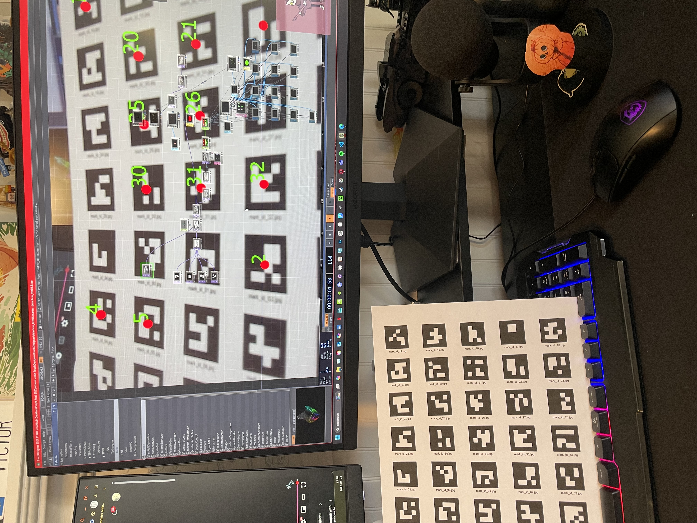
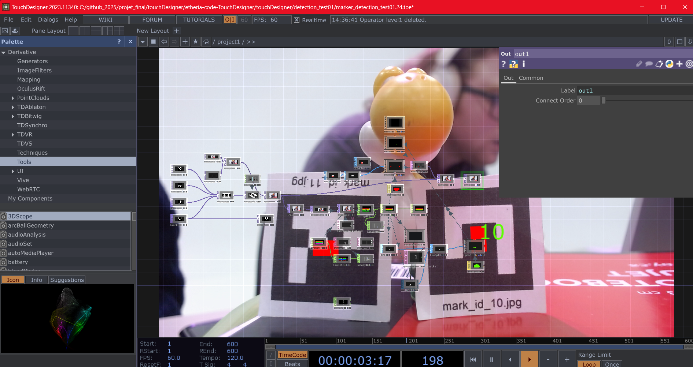

# Victor Gileau

<!---->

## Réalisations

 <!-- Une image par semaine de la réalisation dont tu es le plus fier avec une légende -->

### Semaine 1 :

Ma réalisation de cette semaine est d’avoir complété et compris le [tutoriel](https://www.youtube.com/watch?v=oaHM6CtlqQY&t=1s) pour la détection de code **[ArUco](https://docs.opencv.org/4.x/d5/dae/tutorial_aruco_detection.html)** dans **[TouchDesigner](https://derivative.ca)**.

Tutoriel par [Scott Allen Visual Art](https://www.youtube.com/@ScottAllenvis)

Première itération (2025-01-24) :

---

### Semaine 2 :

Ma réalisation cette semaine est de réussir à recevoir et utiliser les données envoyées par **[TouchDesigner](https://derivative.ca)** dans **[Unity](https://unity.com)**.

En utilisant un script en C# avec l'aide de l'extension ["**extOSC**"] (https://github.com/Iam1337/extOSC). Je me suis aussi beaucoup fier à la documentation de **[Thomas Ouellet Fredericks](https://t-o-f.info/m5_docs/#/unity/extosc/README)**.

J'ai aussi utilisé le code de [Jacob Alarie Brousseau](https://github.com/Les-gars-d-la-table/Canevas-Cosmique/blob/main/docs/journaux/alariebrousseau_jacob_journal.md) pour le code qui calcule l'angle (plus de détails dans cette ["issus"](https://github.com/Ethereal-Creators/Etheria/issues/5)).

Dans Unity (2025-01-29) :

Dans TouchDesigner (2025-01-29) :

---

### Semaine 3 :

<!--* -->
