# Michael Un Dupré

<!--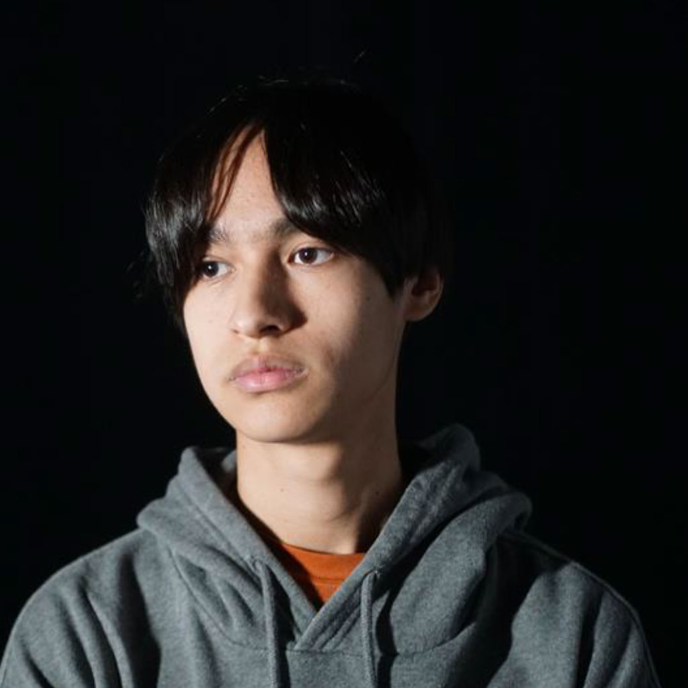-->

 ## Réalisations

 ## Semaine 1:

 Réalisation des spritesheets des projectiles pour notre jeu unity

 média:
 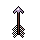
 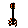
 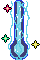
 
 
 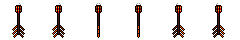
 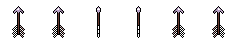
 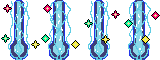
 

 ## Semaine 2:

 Réalisation d'un test sur Unity où que le joueur peut ce déplacer et tirer des ennemies

 média:
 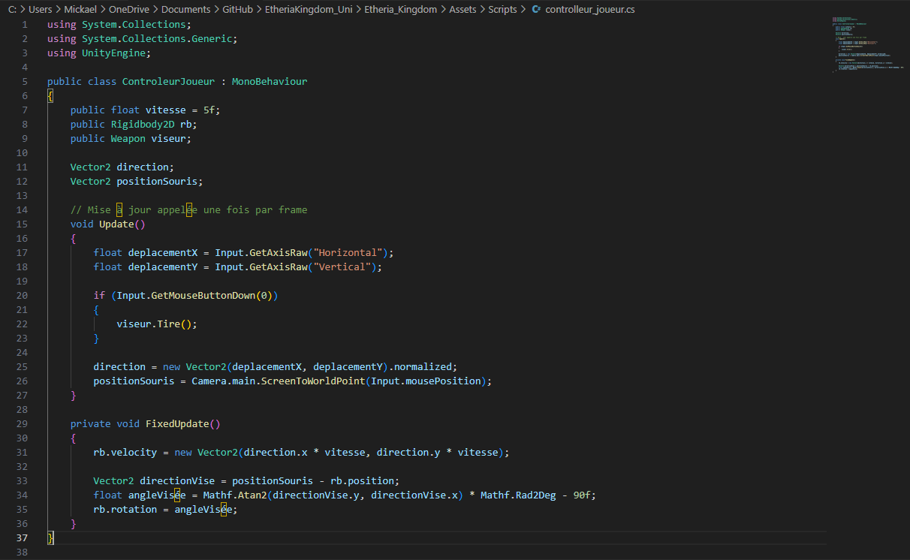
 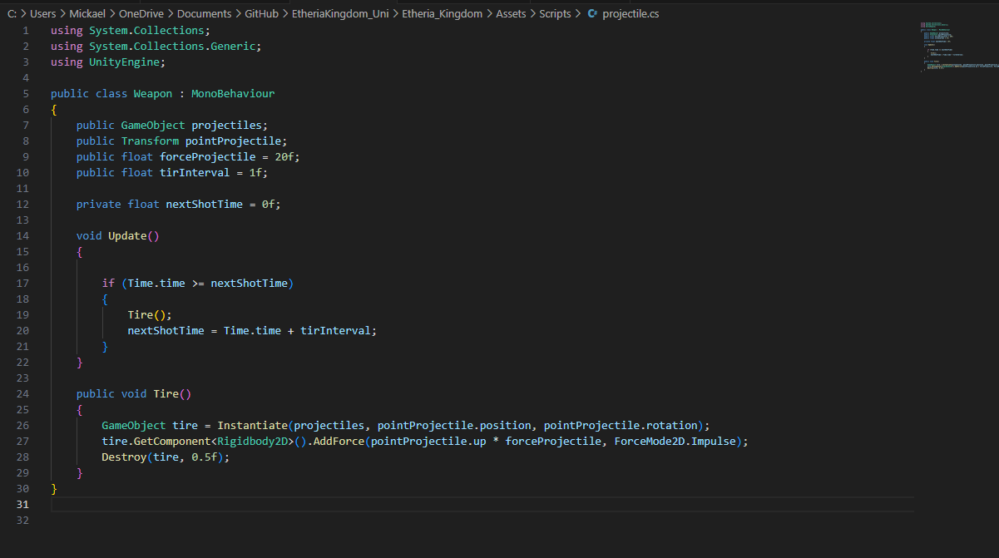
 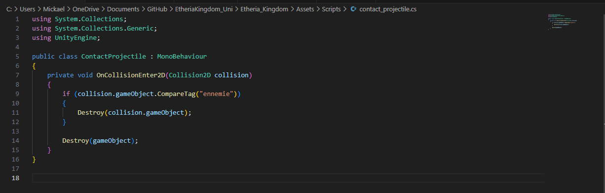

Tutoriel du mouvement par [Gaming with Rafan](https://youtu.be/e7AWtLIH3u8?si=J_QcrePahT2_cVK5)
Tutoriel des projectiles par [Distorted Pixel Studio](https://youtu.be/8TqY6p-PRcs?si=H_twutaN4FaVgBkz)

 ## Semaine 3:

 Réalisation de plus de spritesheet et ajout du crystal qui se fait cibler par les ennemies

 média:
 
  

 ## Semaine 4:

 ajout d'un système de vie au crystal et il peut ce faire détruire et installation de la maquette en équipe

 média:
 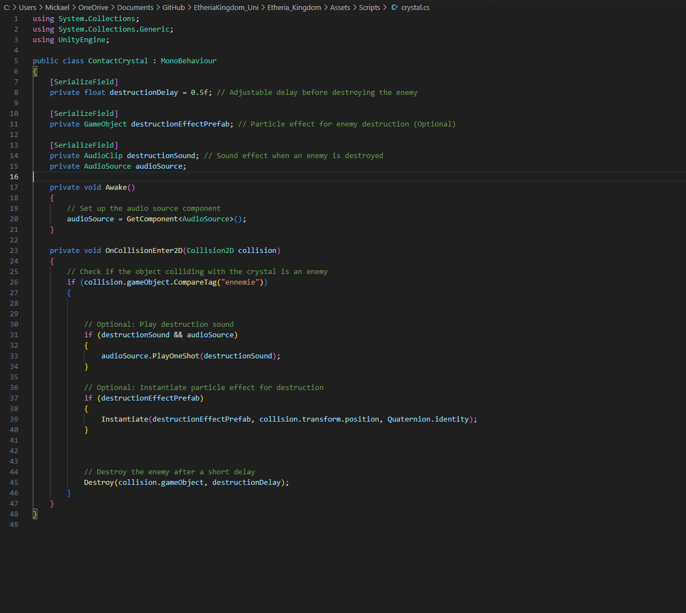 
  <!-- 
  -->

 ## Semaine 5:

 Implimentation de d'autre type d'attaque et céation d'un troisième personnage (le paladin), attaque explosif et une attaque projectile pour le paladin
 Fait en sorte que les ennemies n'apparait pas n'importe ou dans la scène, ils apparaisent or du canvas

 média:
 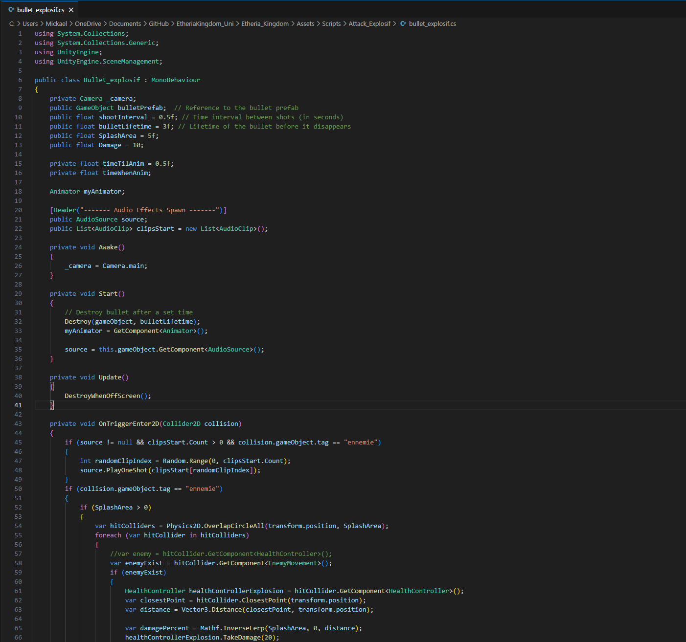 
 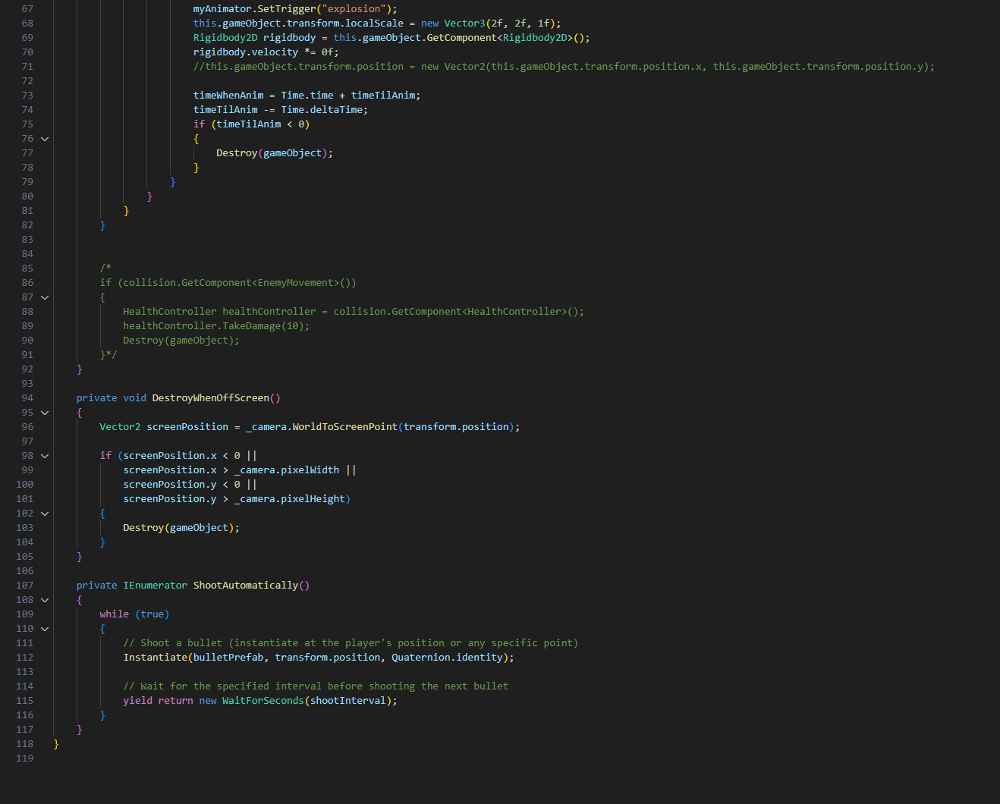 
 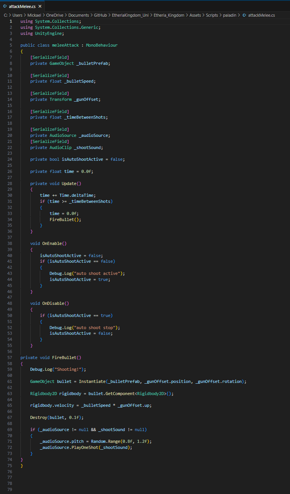 
 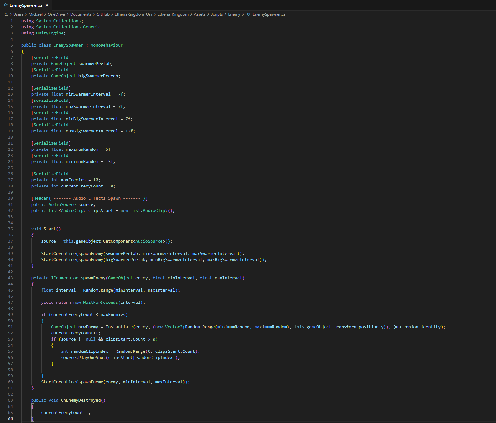 

 
 
  

 <!-- Une image par semaine de la réalisation dont tu es le plus fier avec une légende -->

<!-- *  -->
