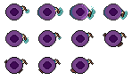
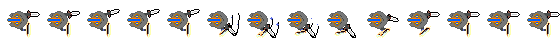
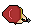
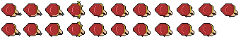
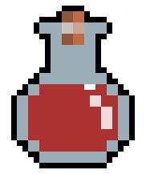
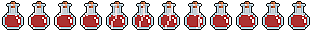
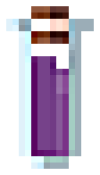
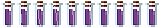
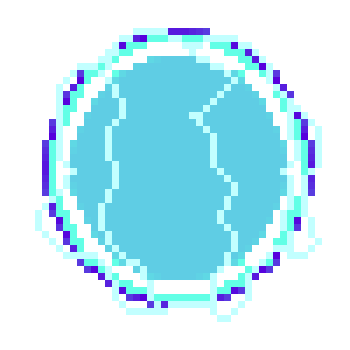

# Pierre-Luc Proulx

---

## 🎮 **Réalisations**

### 🗓 **Semaine 1** : Création des Sprites Sheets

- **Personnages & Ennemis**  
  Conception des sprites sheets pour les personnages et ennemis du jeu.

  - **Mage**  
      # Pierre-Luc Proulx

---

## 🎮 **Réalisations**

### 🗓 **Semaine 1** : Création des Sprites Sheets

- **Personnages & Ennemis**  
  Conception des sprites sheets pour les personnages et ennemis du jeu.

  - **Mage**  
      
    

  - **Paladin**  
      
    

  - **Archer**  
      
    

---

### 🗓 **Semaine 2** : Démo Unity & Nouveaux Sprite Sheets

### 🗓 **Semaine 2** : Démo Unity & Nouveaux Sprite Sheets

- **Démo Unity**  
  Développement d'une démo interactive dans Unity permettant de déplacer un personnage et de créer des spawners pour les ennemis qui suivent le joueur.

- **Nouveaux Sprite Sheets**  
  Création de nouveaux sprites sheets pour enrichir l’univers du jeu, incluant des ennemis supplémentaires et des items à récupérer.

  - **Potion de Régénération**  
      
    

  - **Potion d'Invincibilité**  
      
    

  - **Bouclier**  
      
    

---

### 🗓 **Semaine 3** : Avancement du Gameplay & Modélisation Blender

- **Développement du Gameplay**  
  Amélioration du code du gameplay dans Unity avec de nouvelles mécaniques, améliorant ainsi l’expérience de jeu.

- **Modélisation des Figurines**  
  Début du travail de modélisation 3D des figurines dans Blender pour ajouter un aspect visuel plus immersif au jeu.

---

### 🗓 **Semaine 4** : Animation des Ennemis et Personnages

- 
  

-

---

### 🗓 **Semaine 5** : Système de Sauvegarde et Chargement du Jeu

-
 

-

---

### 🗓 **Semaine 6** : Création du Niveau et Intégration des Sons

- 

- 

---

### 🗓 **Semaine 7** : 

- 

-

---

### 🏆 **Mon travail en images**

  
*Extrait de la démo Unity où le personnage interagit avec l’environnement et les ennemis.*

---

    

  - **Paladin**  
      
    

  - **Archer**  
      
    

---

### 🗓 **Semaine 2** : Démo Unity & Nouveaux Sprite Sheets

- **Démo Unity**  
  Développement d'une démo interactive dans Unity permettant de déplacer un personnage et de créer des spawners pour les ennemis qui suivent le joueur.

- **Nouveaux Sprite Sheets**  
  Création de nouveaux sprites sheets pour enrichir l’univers du jeu, incluant des ennemis supplémentaires et des items à récupérer.

  - Potion de regénération 

- **Potion d'invicinbilité**
  
  

  - Bouclier
  
 
  

---

### 🗓 **Semaine 3** : Avancement du Gameplay & Modélisation Blender

- **Développement du Gameplay**  
  Amélioration du code du gameplay dans Unity avec de nouvelles mécaniques, améliorant ainsi l’expérience de jeu.

- **Modélisation des Figurines**  
  Début du travail de modélisation 3D des figurines dans Blender pour ajouter un aspect visuel plus immersif au jeu.

---

### 🗓 **Semaine 4** : Animation des Ennemis et Personnages

- 
  

-

---

### 🗓 **Semaine 5** : Système de Sauvegarde et Chargement du Jeu

-
 

-

---

### 🗓 **Semaine 6** : Création du Niveau et Intégration des Sons

- 

- 

---

### 🗓 **Semaine 7** : 

- 

-

---

### 🏆 **Mon travail en images**

  
*Extrait de la démo Unity où le personnage interagit avec l’environnement et les ennemis.*

---
