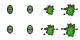
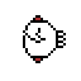

# Pierre-Luc Proulx


---

## 🎮 **Réalisations**

### 🗓 **Semaine 1** : Création des Sprites Sheets

- **Personnages & Ennemis**  
  Conception des sprites sheets pour les personnages et ennemis du jeu.

  - **Mage**  
      
    

  - **Paladin**  
      
    

  - **Archer**  
      
    

  - **Mouche**  
      
    

  - **Skeleton**  
      
    

---

### 🗓 **Semaine 2** : Démo Unity & Nouveaux Sprite Sheets

- **Démo Unity**  
  Développement d'une démo interactive dans Unity permettant de déplacer un personnage et de créer des spawners pour les ennemis qui suivent le joueur.
  - Plusieurs Scripts pour le jeu complété
    1. Health Controller
   
    
```c#
using System.Collections;
using System.Collections.Generic;
using UnityEngine;
using UnityEngine.Events;

public class HealthController : MonoBehaviour
{
    [Header("------- Health Variables -------")]
    [SerializeField]
    private float _currentHealth;

    [SerializeField]
    private float _maximumHealth;

    [Header("------- Component references -------")]
    private SpriteRenderer spriteRenderer;
    private Rigidbody2D rigidbody2D;

    [Header("------- Visual and Audio Effects -------")]
    [SerializeField]
    private Color damagedColor = Color.red;

    [SerializeField]
    private float blinkDuration = 0.2f;

    [SerializeField]
    private int deathBlinkCount = 3;

    [SerializeField]
    private ParticleSystem bleedingParticles;

    [SerializeField]
    private AudioSource source;

    public List<AudioClip> clips = new List<AudioClip>();

    public UnityEvent OnDied;
    public UnityEvent OnDamaged;
    public UnityEvent OnHealthChanged;

    private void Awake()
    {
        spriteRenderer = GetComponent<SpriteRenderer>();
        rigidbody2D = GetComponent<Rigidbody2D>();
        source = GetComponent<AudioSource>();
    }

    void Start()
    {
        source = GetComponent<AudioSource>();
    }

    public float RemainingHealthPercentage => _currentHealth / _maximumHealth;
    public bool IsInvincible { get; set; }

    public void TakeDamage(float damageAmount)
    {
        if (_currentHealth == 0 || IsInvincible) return;

        _currentHealth -= damageAmount;
        OnHealthChanged.Invoke();

        if (bleedingParticles != null)
        {
            bleedingParticles.transform.position = transform.position;
            bleedingParticles.Play();
        }

        if (spriteRenderer != null)
        {
            StartCoroutine(BlinkDamageEffect());
        }

        if (_currentHealth <= 0)
        {
            _currentHealth = 0;
            OnDied.Invoke();
            HandleDeath();
        }
        else
        {
            OnDamaged.Invoke();
        }
    }

    public void AddHealth(float amountToAdd)
    {
        if (_currentHealth == _maximumHealth) return;

        _currentHealth += amountToAdd;
        OnHealthChanged.Invoke();

        if (_currentHealth > _maximumHealth)
        {
            _currentHealth = _maximumHealth;
        }
    }

    private IEnumerator BlinkDamageEffect()
    {
        Color originalColor = spriteRenderer.color;
        spriteRenderer.color = damagedColor;
        yield return new WaitForSeconds(blinkDuration);
        spriteRenderer.color = originalColor;
    }

    private IEnumerator BlinkDeathEffect()
    {
        Color originalColor = spriteRenderer.color;

        for (int i = 0; i < deathBlinkCount; i++)
        {
            spriteRenderer.color = damagedColor;
            yield return new WaitForSeconds(blinkDuration);
            spriteRenderer.color = originalColor;
            yield return new WaitForSeconds(blinkDuration);
        }

        Destroy(gameObject);
    }

    private void HandleDeath()
    {
        if (rigidbody2D != null)
        {
            rigidbody2D.velocity = Vector2.zero;
            rigidbody2D.isKinematic = true;
        }
    }

    public void soundWhenDameged()
    {
        Debug.Log("Dameged");
        if (source != null)
        {
            int randomClipIndex = Random.Range(0, clips.Count);
            source.PlayOneShot(clips[randomClipIndex]);
        }
    }
}
```
```c#
2. EnemySpawner
   using System.Collections;
using System.Collections.Generic;
using UnityEngine;

public class EnemySpawner : MonoBehaviour
{
    [SerializeField]
    private GameObject swarmerPrefab;
    [SerializeField]
    private GameObject bigSwarmerPrefab;

    [SerializeField]
    private float minSwarmerInterval = 2f;
    [SerializeField]
    private float maxSwarmerInterval = 5f; 
    [SerializeField]
    private float minBigSwarmerInterval = 7f; 
    [SerializeField]
    private float maxBigSwarmerInterval = 12f; 

    [SerializeField]
    private int maxEnemies = 10; 
    private int currentEnemyCount = 0;

    

    void Start()
    {
        StartCoroutine(spawnEnemy(swarmerPrefab, minSwarmerInterval, maxSwarmerInterval));
        StartCoroutine(spawnEnemy(bigSwarmerPrefab, minBigSwarmerInterval, maxBigSwarmerInterval));
    }

    private IEnumerator spawnEnemy(GameObject enemy, float minInterval, float maxInterval)
    {
        float interval = Random.Range(minInterval, maxInterval);

        yield return new WaitForSeconds(interval);

        if (currentEnemyCount < maxEnemies)
        {
            GameObject newEnemy = Instantiate(enemy, new Vector3(Random.Range(-5f, 5f), Random.Range(-7f, 7f), 0), Quaternion.identity);
            currentEnemyCount++;

        }
        StartCoroutine(spawnEnemy(enemy, minInterval, maxInterval));
    }

    public void OnEnemyDestroyed()
    {
        currentEnemyCount--;
    }
}
```


- **Nouveaux Sprite Sheets**  
  Création de nouveaux sprites sheets + animation pour enrichir l’univers du jeu, incluant des ennemis supplémentaires et des items à récupérer.

  - **Potion de Régénération**  
      
    

  - **Potion d'Invincibilité**  
      
    

  - **Bouclier**  
      
    

  - **Slimes**  
      
    

---

### 🗓 **Semaine 3** : Avancement du Gameplay & Modélisation Blender

- **Développement du Gameplay**  
  Amélioration du code du gameplay dans Unity avec de nouvelles mécaniques, améliorant ainsi l’expérience de jeu.

  - Développement d'un UI pour le jeu
  - Sprite Sheet pour coeur

    
- **Modélisation des Figurines**  
  Début du travail de modélisation 3D des figurines dans Blender pour ajouter un aspect visuel plus immersif au jeu.

  

---

### 🗓 **Semaine 4** : Commencer à faire un concept de modèle 3D et travail supplémentaire sur les scripts du jeu

- **Animations des Ennemis**  
  Travail sur les animations des ennemis pour renforcer leur fluidité et leur comportement en jeu.

- **Animations des Personnages**  
  Conception d'animations pour les personnages jouables afin d'améliorer leur réactivité.

---

### 🗓 **Semaine 5** : Création de powerups et buff abilities

- Ajout d'amélioration d'attributs du personnage pour un total de 4 améliorations
  - Regénération de vie du crystal
```c#
using UnityEngine;

public class Health : MonoBehaviour
{
    public float maxHealth = 100f;
    public float currentHealth;

    private void Start()
    {
        currentHealth = maxHealth; // Set the health to max at the start
    }

    public void IncreaseHealth(float amount)
    {
        currentHealth = Mathf.Min(currentHealth + amount, maxHealth); // Prevent going over max health
    }

    public void TakeDamage(float amount)
    {
        currentHealth = Mathf.Max(currentHealth - amount, 0f); // Prevent going below 0 health
    }
}

```
  - Amélioration de la vitesse 
```c#
using System.Collections;
using System.Collections.Generic;
using UnityEngine;

[CreateAssetMenu(menuName = "Powerups/SpeedBuff")]
public class SpeedBuff : PowerUpEffect
{
    public float amount; // The amount by which to decrease the player's shooting time

    public override void Apply(GameObject target)
    {
        // Apply the effect to the PlayerShoot component
        PlayerShoot playerShoot = target.GetComponent<PlayerShoot>();
        if (playerShoot != null)
        {
            // Decrease the time between shots to make shooting faster
            playerShoot._timeBetweenShots -= amount;

            // Ensure the time between shots doesn't go below a minimum threshold (e.g., 0.1 seconds)
            playerShoot._timeBetweenShots = Mathf.Max(playerShoot._timeBetweenShots, 0.1f);
        }

        // Try to find the child object "Archer" and get the SpriteRenderer component
        Transform archerTransform = target.transform.Find("Archer");
        //private Transform archerTransform = GameObject.FindWithTag("JoueurSprite");
        if (archerTransform != null)
        {
            SpriteRenderer spriteRenderer = archerTransform.GetComponent<SpriteRenderer>();
            if (spriteRenderer != null)
            {
                spriteRenderer.color = Color.blue; // Change color to blue (or any color you prefer)
            }

            // Try to get the Animator component from the "Archer" child
            Animator animator = archerTransform.GetComponent<Animator>();
            if (animator != null)
            {
                // Speed up the animation by modifying the Animator's speed
                animator.speed += amount; // You can adjust this logic as per your need
            }
        }
    }
}


```
  - Ajout d'un bouclier au joueur et au crystal qui donne des dommages aux ennemis en collision
```c#
using UnityEngine;

[CreateAssetMenu(fileName = "New Shield Buff", menuName = "Powerups/Shield Buff")]
public class ShieldBuff : PowerUpEffect
{
    public GameObject shieldPrefab; // The shield prefab that will appear on the player
    private GameObject currentShield;

    public override void Apply(GameObject target)
    {
        // Check if the player already has a shield to prevent multiple shields
        if (currentShield != null)
        {
            Debug.Log("Shield already applied, destroying previous shield.");
            Destroy(currentShield); // Remove the previous shield if it exists
        }

        // Instantiate the shield prefab at the player's position
        Debug.Log("Applying shield buff to player: " + target.name);
        currentShield = Instantiate(shieldPrefab, target.transform.position, Quaternion.identity);
        currentShield.transform.SetParent(target.transform); // Make the shield follow the player

        // Log when the shield is instantiated
        Debug.Log("Shield spawned at position: " + target.transform.position);

        // Add ShieldScaler component to handle the scaling
        ShieldScaler shieldScaler = currentShield.AddComponent<ShieldScaler>();

        // Optionally, you can adjust the scaling parameters here if you want to modify them for each shield instance:
        shieldScaler.scaleDuration = 0.6f;
        shieldScaler.targetScale = new Vector3(4f, 4f, 4f);
        shieldScaler.initialScale = new Vector3(0.1f, 0.1f, 0.1f);
    }
}

```
  - Amélioration des dégats


---

### 🗓 **Semaine 6** : Création du Niveau et Intégration des Sons

- **À compléter**

---

### 🗓 **Semaine 7** : 

- **À compléter**

---

### 🏆 **Mon travail en images**

  
*Extrait de la démo Unity où le personnage interagit avec l’environnement et les ennemis.*
