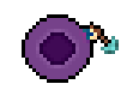
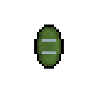
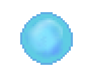

# Pierre-Luc Proulx


---

## 🎮 **Réalisations**

### 🗓 **Semaine 1** : Création des Sprites Sheets

- **Personnages & Ennemis**  
  Conception des sprites sheets pour les personnages et ennemis du jeu.

  - **Mage**  
      
    

  - **Paladin**  
      
    

  - **Archer**  
      
    

  - **Mouche**  
      
    

  - **Skeleton**  
      
    

---

### 🗓 **Semaine 2** : Démo Unity & Nouveaux Sprite Sheets

- **Démo Unity**  
  Développement d'une démo interactive dans Unity permettant de déplacer un personnage et de créer des spawners pour les ennemis qui suivent le joueur.
  - Plusieurs Scripts pour le jeu complété
    1. Health Controller
   
    
```
using System.Collections;
using System.Collections.Generic;
using UnityEngine;
using UnityEngine.Events;

public class HealthController : MonoBehaviour
{
    [Header("------- Health Variables -------")]
    [SerializeField]
    private float _currentHealth;

    [SerializeField]
    private float _maximumHealth;

    [Header("------- Component references -------")]
    private SpriteRenderer spriteRenderer;
    private Rigidbody2D rigidbody2D;

    [Header("------- Visual and Audio Effects -------")]
    [SerializeField]
    private Color damagedColor = Color.red;

    [SerializeField]
    private float blinkDuration = 0.2f;

    [SerializeField]
    private int deathBlinkCount = 3;

    [SerializeField]
    private ParticleSystem bleedingParticles;

    [SerializeField]
    private AudioSource source;

    public List<AudioClip> clips = new List<AudioClip>();

    public UnityEvent OnDied;
    public UnityEvent OnDamaged;
    public UnityEvent OnHealthChanged;

    private void Awake()
    {
        spriteRenderer = GetComponent<SpriteRenderer>();
        rigidbody2D = GetComponent<Rigidbody2D>();
        source = GetComponent<AudioSource>();
    }

    void Start()
    {
        source = GetComponent<AudioSource>();
    }

    public float RemainingHealthPercentage => _currentHealth / _maximumHealth;
    public bool IsInvincible { get; set; }

    public void TakeDamage(float damageAmount)
    {
        if (_currentHealth == 0 || IsInvincible) return;

        _currentHealth -= damageAmount;
        OnHealthChanged.Invoke();

        if (bleedingParticles != null)
        {
            bleedingParticles.transform.position = transform.position;
            bleedingParticles.Play();
        }

        if (spriteRenderer != null)
        {
            StartCoroutine(BlinkDamageEffect());
        }

        if (_currentHealth <= 0)
        {
            _currentHealth = 0;
            OnDied.Invoke();
            HandleDeath();
        }
        else
        {
            OnDamaged.Invoke();
        }
    }

    public void AddHealth(float amountToAdd)
    {
        if (_currentHealth == _maximumHealth) return;

        _currentHealth += amountToAdd;
        OnHealthChanged.Invoke();

        if (_currentHealth > _maximumHealth)
        {
            _currentHealth = _maximumHealth;
        }
    }

    private IEnumerator BlinkDamageEffect()
    {
        Color originalColor = spriteRenderer.color;
        spriteRenderer.color = damagedColor;
        yield return new WaitForSeconds(blinkDuration);
        spriteRenderer.color = originalColor;
    }

    private IEnumerator BlinkDeathEffect()
    {
        Color originalColor = spriteRenderer.color;

        for (int i = 0; i < deathBlinkCount; i++)
        {
            spriteRenderer.color = damagedColor;
            yield return new WaitForSeconds(blinkDuration);
            spriteRenderer.color = originalColor;
            yield return new WaitForSeconds(blinkDuration);
        }

        Destroy(gameObject);
    }

    private void HandleDeath()
    {
        if (rigidbody2D != null)
        {
            rigidbody2D.velocity = Vector2.zero;
            rigidbody2D.isKinematic = true;
        }
    }

    public void soundWhenDameged()
    {
        Debug.Log("Dameged");
        if (source != null)
        {
            int randomClipIndex = Random.Range(0, clips.Count);
            source.PlayOneShot(clips[randomClipIndex]);
        }
    }
}
	```

- **Nouveaux Sprite Sheets**  
  Création de nouveaux sprites sheets pour enrichir l’univers du jeu, incluant des ennemis supplémentaires et des items à récupérer.

  - **Potion de Régénération**  
      
    

  - **Potion d'Invincibilité**  
      
    

  - **Bouclier**  
      
    

  - **Slimes**  
      
    

---

### 🗓 **Semaine 3** : Avancement du Gameplay & Modélisation Blender

- **Développement du Gameplay**  
  Amélioration du code du gameplay dans Unity avec de nouvelles mécaniques, améliorant ainsi l’expérience de jeu.

- **Modélisation des Figurines**  
  Début du travail de modélisation 3D des figurines dans Blender pour ajouter un aspect visuel plus immersif au jeu.

---

### 🗓 **Semaine 4** : Animation des Ennemis et Personnages

- **Animations des Ennemis**  
  Travail sur les animations des ennemis pour renforcer leur fluidité et leur comportement en jeu.

- **Animations des Personnages**  
  Conception d'animations pour les personnages jouables afin d'améliorer leur réactivité.

---

### 🗓 **Semaine 5** : Système de Sauvegarde et Chargement du Jeu

- **Implémentation d'un système de sauvegarde**  
  Création d'un système permettant de sauvegarder l'état du jeu et de le charger lors de prochaines sessions de jeu.

---

### 🗓 **Semaine 6** : Création du Niveau et Intégration des Sons

- **Création du Niveau**  
  Conception et intégration des différents éléments pour le premier niveau du jeu, incluant les décors et les obstacles.

- **Intégration des Sons**  
  Ajout des effets sonores et de la musique de fond pour améliorer l'immersion du joueur.

---

### 🗓 **Semaine 7** : 

- **À compléter**

---

### 🏆 **Mon travail en images**

  
*Extrait de la démo Unity où le personnage interagit avec l’environnement et les ennemis.*
