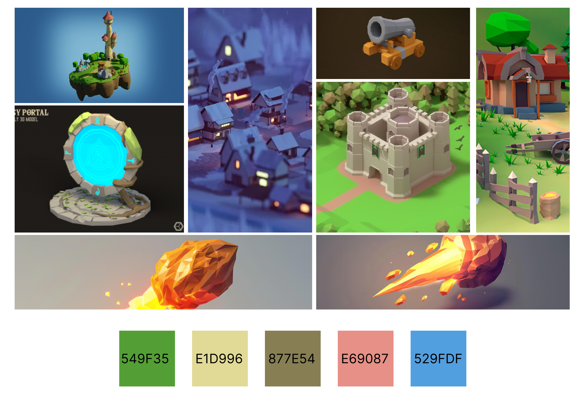

# Ambiance

 Etheria est animé par une esthétique unique, mêlant un style pixel art à une ambiance sonore rétro envoûtante, inspirée des classiques 8-bit. Chaque détail, des textures aux effets sonores, contribue à créer une expérience immersive.

Conçu pour les amateurs de jeu de survie, Etheria encourage les joueurs à développer leur esprit tactique tout en cultivant le plaisir du jeu. Que ce soit à travers des combats intenses, ou des stratégies minutieusement élaborées, chaque partie promet un défi renouvelé, destiné à protéger le crystal d'Étheria.

<!-- Ici mettre tous les documents et références associés à l'établissement de l'ambiance du projet   -->
## Ambiance Sonores
[Ambiance Exemple 01](https://youtu.be/2Mg6b0LJfM8?list=PLdsGes2mFh92eHpOZVJQgoubb6rF0CcvU)
 
[Ambiance Exemple 02](https://www.youtube.com/watch?v=5bn3Jmvep1k)

<!-- ## Références -->
<!--
[Ambiance](https://tim-montmorency.com/582523-gestion/#/contenus/2_scenarisation/30_ambiances/)
-->
