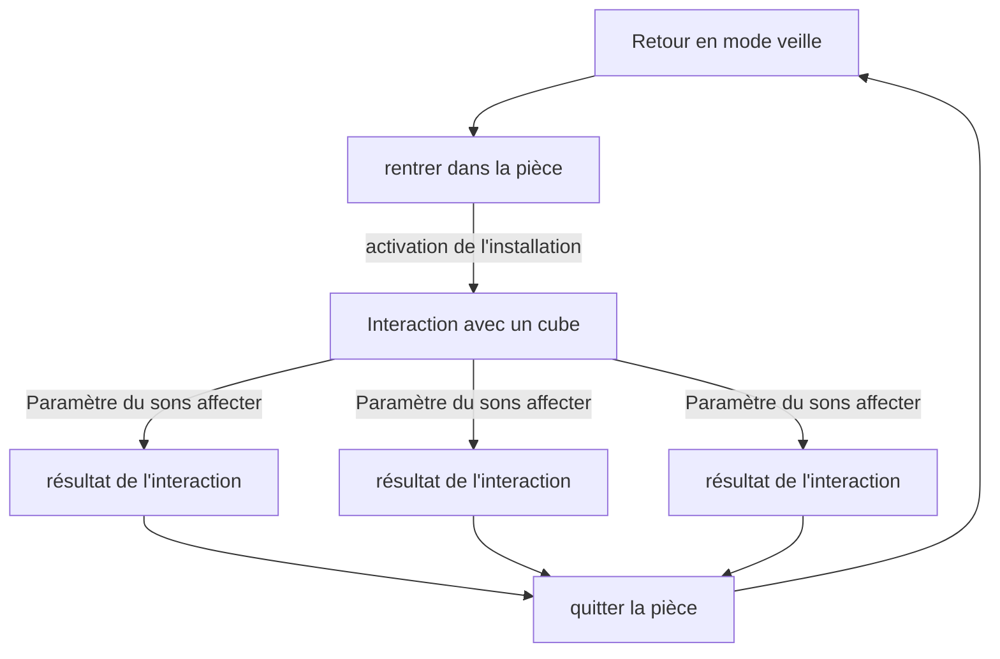

# Scénario

<!-- Ici mettre tous les documents et références concernant la scéanrisation de l'expérience   -->

* Tous les verbes disponibles à vos interacteurs

* Tous les objets sur lesquels chaque verbe peut agir et comment ils le font

* Actions émergentes que vous aimeriez que vos interacteurs effectuent

* Toutes les façons que les interacteurs peuvent faire progresser l’expérience

## Progression
L'utilisateur fait progresser l'expérience en jouant avec les faces des cubes pour ajouter des sons et des effets pour leur donner un produit final qui leur est satisfaisant.

## Références

* [Scénario Interactif](https://tim-montmorency.com/582523-gestion/#/contenus/2_scenarisation/20_scenario/20_interactif/)
* [Expérience usager UX](https://tim-montmorency.com/582523-gestion/#/contenus/2_scenarisation/20_scenario/40_ux/)

