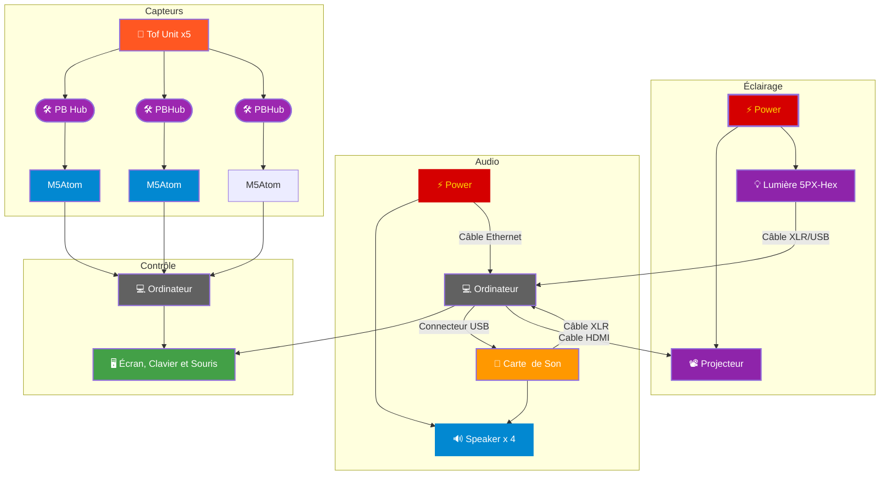

# Synoptique

```mermaid
flowchart TD
    %% AUDIO %%
    subgraph Audio
        n1["⚡ Power"] --> n2["🔊 Speaker x 4"]
        n11["🎵 Carte&nbsp; de Son"] --> n2
        n11 -- Câble XLR --> n3
    end

    %% CONTRÔLE %%
    subgraph Contrôle
        n1 -- Câble Ethernet --> n3["💻 Ordinateur"]
        n3 --> n10["🖥️ Écran, Clavier et Souris"]
        n3 -- Connecteur USB --> n11
        n13["💻 Ordinateur"] --> n10
    end

    %% ÉCLAIRAGE %%
    subgraph Éclairage
        n7["⚡ Power"] --> n8["📽️ Projecteur"] & n9["💡 Lumière 5PX-Hex"]
        n9 -- Câble XLR/USB --> n3
    end

    %% CAPTEURS %%
    subgraph Capteurs
        n15["📡 Tof Unit x5"] --> n18(["🛠 PB Hub"])
        n15["📡 Tof Unit x5"] --> n19(["🛠 PB Hub"])
        n15["📡 Tof Unit x5"] --> n20(["🛠 PB Hub"])
        n18 --> n14["M5Atom"]
        n14 --> n13
        n16 --> n13
        n4 --> n13
        n19(["🛠 PBHub"]) --> n16["M5Atom"]
        n20(["🛠 PBHub"]) --> n4["M5Atom"]
    end

    %% CONNEXIONS TRANSVERSALES %%
    n3 -- Cable HDMI --> n8

    %% STYLES %%
    style n1 stroke:#D50000,fill:#D50000,color:#FFD600,stroke-width:3px
    style n2 stroke:#0288D1,fill:#0288D1,color:#FFFFFF,stroke-width:2px
    style n3 fill:#616161,color:#FFFFFF,stroke-width:2px
    style n13 fill:#616161,color:#FFFFFF,stroke-width:2px
    style n7 fill:#D50000,color:#FFD600,stroke-width:3px
    style n10 fill:#43A047,color:#FFFFFF,stroke-width:2px
    style n11 fill:#FF9800,color:#FFFFFF,stroke-width:2px
    style n8 fill:#8E24AA,color:#FFFFFF,stroke-width:2px
    style n9 fill:#8E24AA,color:#FFFFFF,stroke-width:2px
    style n16 fill:#0288D1,color:#FFFFFF,stroke-width:2px
    style n14 fill:#0288D1,color:#FFFFFF,stroke-width:2px
    style n15 fill:#FF5722,color:#FFFFFF,stroke-width:2px
    style n18 fill:#9C27B0,color:#FFFFFF,stroke-width:2px
    style n19 fill:#9C27B0,color:#FFFFFF,stroke-width:2px
    style n20 fill:#9C27B0,color:#FFFFFF,stroke-width:2px


```

## Références

* [Synoptique](https://tim-montmorency.com/582523-gestion/#/contenus/3_planification/10_synoptique/)

