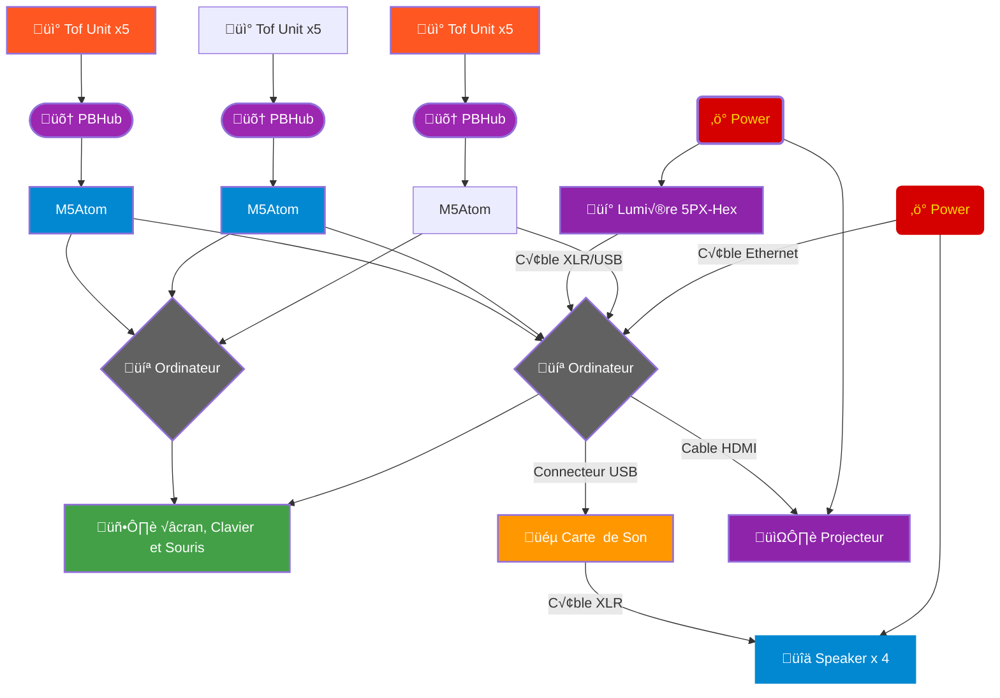

# Synoptique

```mermaid
flowchart TD
    n1["‚ö° Power"] --> n2["üîä Speaker x 4"]
    n1 -- Câble Ethernet --> n3["💻 Ordinateur"]
    n3 --> n10["🖥️ Écran, Clavier et Souris"]
    n3 -- Connecteur USB --> n11["üéµ Carte&nbsp; de Son"]
    n4["M5Atom"] --> n13["💻 Ordinateur"] & n3
    n7["⚡ Power"] --> n8["📽️ Projecteur"] & n9["💡 Lumière 5PX-Hex"]
    n9 -- C√¢ble XLR/USB --> n3
    n11 -- C√¢ble XLR --> n2
    n16["M5Atom"] --> n13 & n3
    n14["M5Atom"] --> n13 & n3
    n13 --> n10
    n15["üì° Tof Unit x5"] --> n18(["üõ† PBHub"])
    n18 --> n14
    n5["üì° Tof Unit x5"] --> n19(["üõ† PBHub"])
    n17["üì° Tof Unit x5"] --> n20(["üõ† PBHub"])
    n19 --> n16
    n20 --> n4
    n3 -- Cable HDMI --> n8

    n1@{ shape: rounded, width: 1.5, height: 1.5}
    n2@{ shape: rect, width: 2, height: 1.2 }
    n3@{ shape: diam, width: 1.8, height: 1.8 }
    n13@{ shape: diam, width: 1.8, height: 1.8 }
    n7@{ shape: rounded, width: 1.5, height: 1.5 }
    n16@{ shape: rect, width: 2, height: 1.2 }
    n14@{ shape: rect, width: 2, height: 1.2 }
    n15@{ shape: rect, width: 2, height: 1.2 }
    n17@{ shape: rect, width: 2, height: 1.2 }
    
    style n1 stroke:#D50000,fill:#D50000,color:#FFD600,stroke-width:3px
    style n2 stroke:#0288D1,fill:#0288D1,color:#FFFFFF,stroke-width:2px
    style n3 fill:#616161,color:#FFFFFF,stroke-width:2px
    style n13 fill:#616161,color:#FFFFFF,stroke-width:2px
    style n7 fill:#D50000,color:#FFD600,stroke-width:3px
    style n10 fill:#43A047,color:#FFFFFF,stroke-width:2px
    style n11 fill:#FF9800,color:#FFFFFF,stroke-width:2px
    style n8 fill:#8E24AA,color:#FFFFFF,stroke-width:2px
    style n9 fill:#8E24AA,color:#FFFFFF,stroke-width:2px
    style n16 fill:#0288D1,color:#FFFFFF,stroke-width:2px
    style n14 fill:#0288D1,color:#FFFFFF,stroke-width:2px
    style n15 fill:#FF5722,color:#FFFFFF,stroke-width:2px
    style n17 fill:#FF5722,color:#FFFFFF,stroke-width:2px
    style n18 fill:#9C27B0,color:#FFFFFF,stroke-width:2px
    style n19 fill:#9C27B0,color:#FFFFFF,stroke-width:2px
    style n20 fill:#9C27B0,color:#FFFFFF,stroke-width:2px


```

## Références

* [Synoptique](https://tim-montmorency.com/582523-gestion/#/contenus/3_planification/10_synoptique/)

