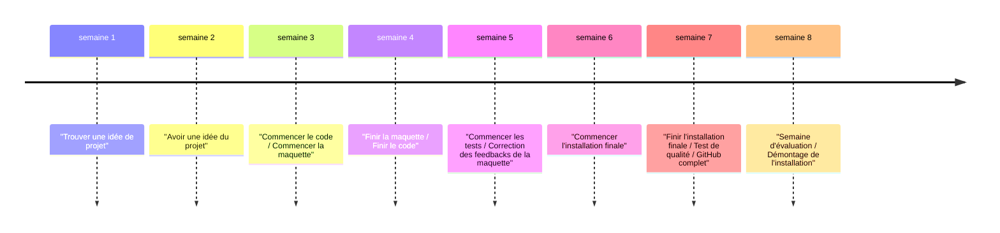

# Contenu multimédia

<!--
## Références

* [Inventaire multimédia](https://tim-montmorency.com/582523-gestion/#/contenus/3_planification/70_inventaire_multimedia/)
* [Arborescence](https://tim-montmorency.com/582523-gestion/#/contenus/3_planification/71_arborescence/)
* [Nomenclature](https://tim-montmorency.com/582523-gestion/#/contenus/3_planification/72_nomenclature/)
-->

