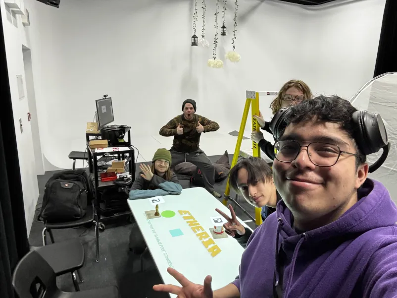
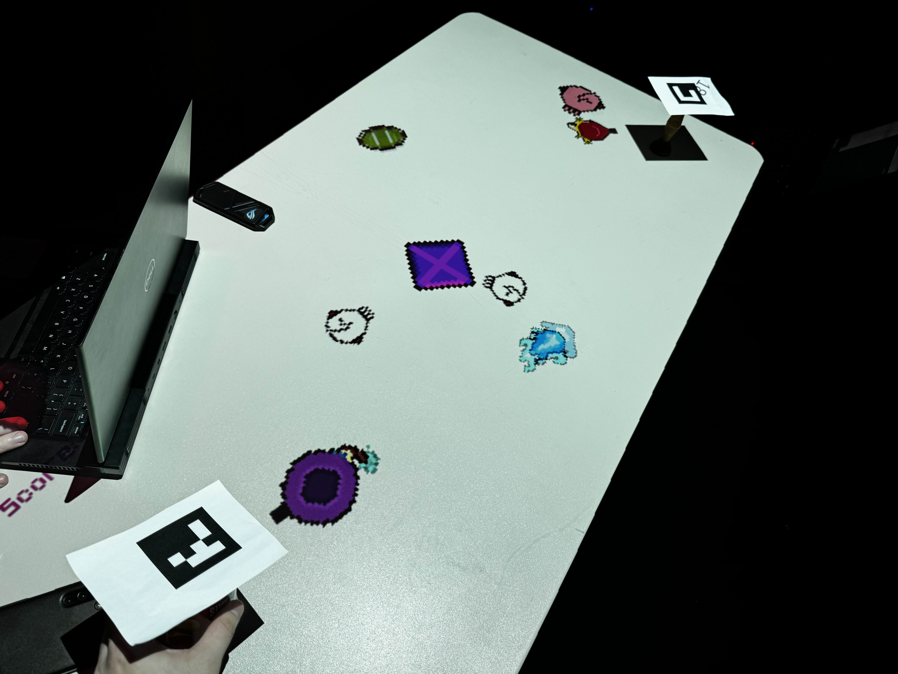

# Maquette

Documentation de la maquette, son fonctionnement, ce qu'elle teste et le résultat de ce test

La maquette est une première itération du jeu, avec un fond blanc pour minimiser la perte de signal des arUco. De plus, elle sert a montrer un "gameloop" initiale de menu, jeu (défense de la pierre) et fin pour ensuite revenir au début. Le signale fonctionne grace a une caméra Sony  

## Gallerie d'images

## Vidéo du la maquette en action

## Références 

* [Étude de faisabilité](https://tim-montmorency.com/582523-gestion/#/contenus/4_faisabilite/10_etude/)
* [Maquette](https://tim-montmorency.com/582523-gestion/#/contenus/4_faisabilite/30_maquette/)

