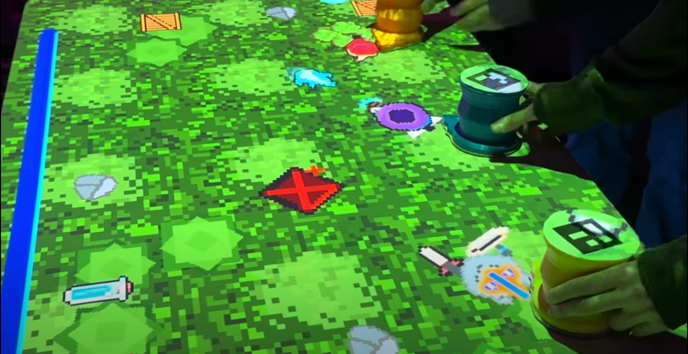
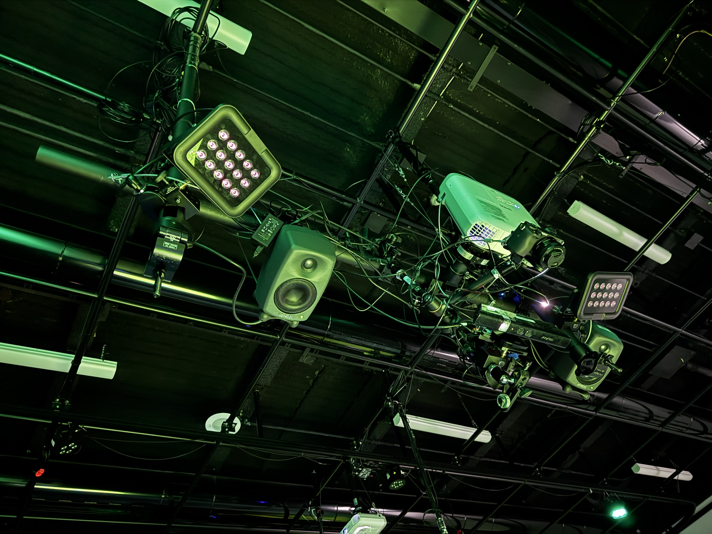
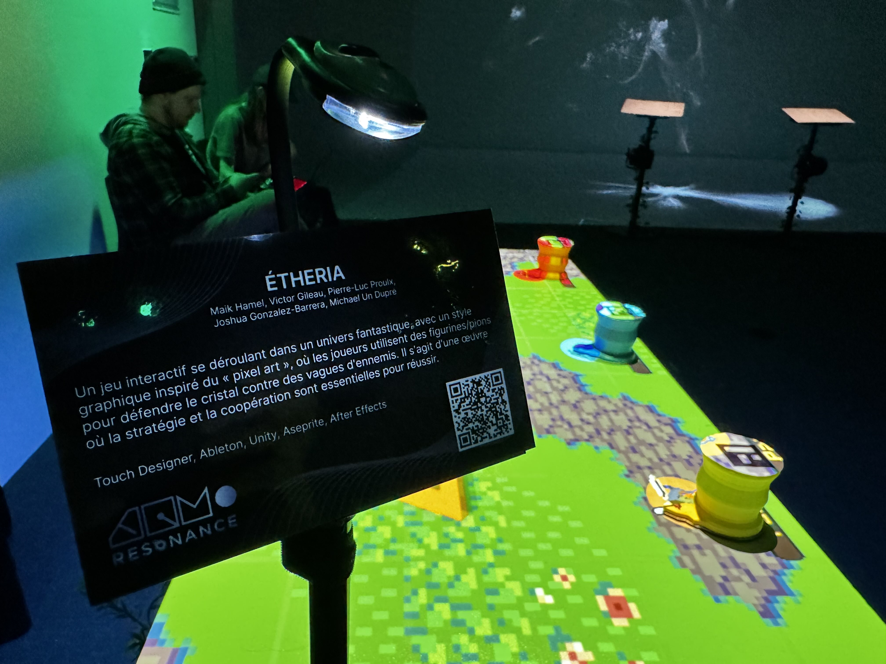
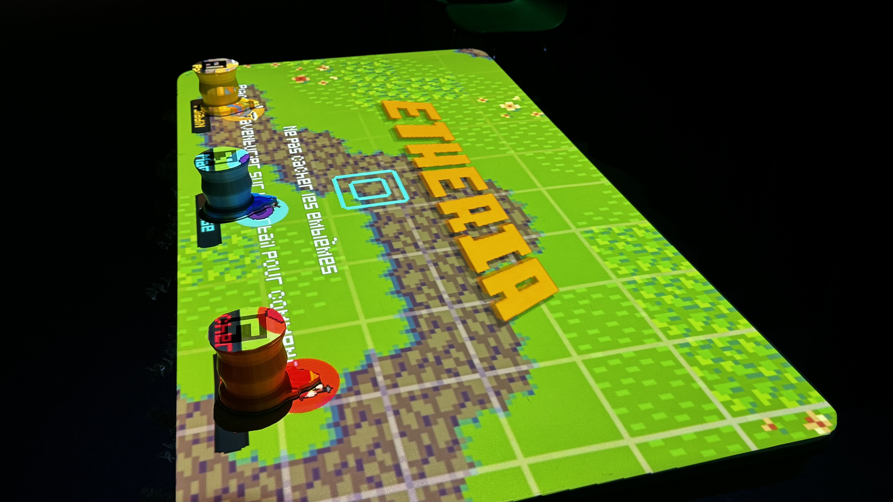
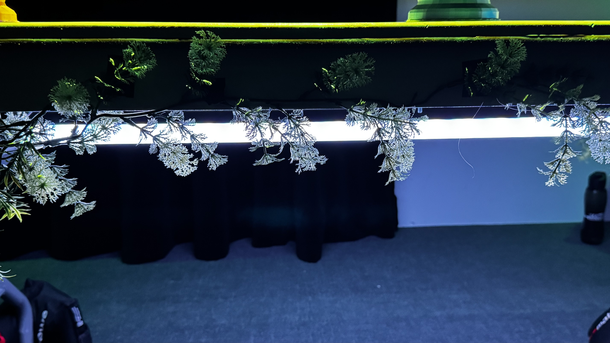

# Diffusion

### Documentation du projet finalisé 

* 
* 
* 
* 
* 
* 
* 
* 

#### Vidéo de la diffusion

#### Ambiance sonore

<!--
* 
-->

<!--
* Vidéo 

* Documentation vidéo de l'installation en action
-->

### Manuel d'instruction pour opération

1. Ouvrir le projecteur

2. Ouvrir Github Desktop et "Fetch" dans le repository d'Etheria_Kingdom et Etheria TouchDesigner pour s'assurer que tout les fichiers sont mise à jour.

3. Dans le dossier du repository Etheria TouchDesigner, ouvrir le fichier du spout et ensuite, lorsqu'il est ouvert, ouvrir le fichier de "marker_detection". Il est important que ces deux fenêtres soient ouvertes et visibles lors du déroulement du jeu.

4. Ouvrir le fichier madMapper associé au jeu. Ensuite, clicker sur le mapping à gauche et clicker sur le spout "TDSyphoonSpoutQ" situé à droite. Finalement, en haut à gauche, dans "Output", checker "Full Screen Mode". 

5. Ouvrir Unity Hub, ouvrez le fichier "Etheria_Kingdom", et ensuite partez le jeu.

