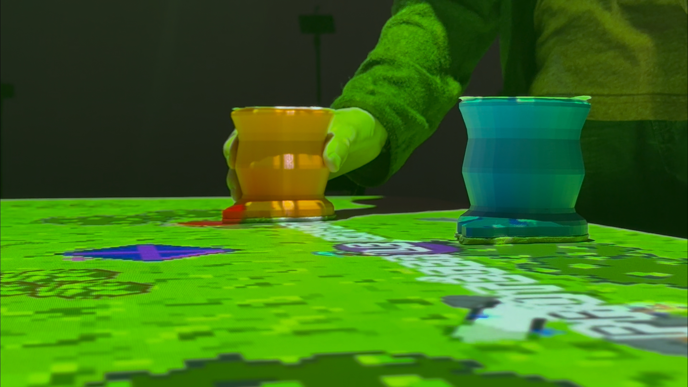
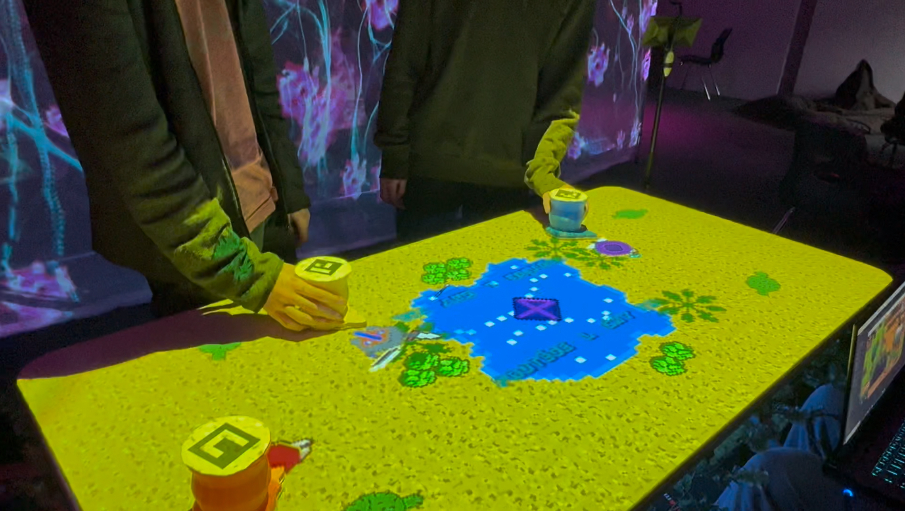

# Étheria
**Étheria** est un projet interactif en pixel qui consiste à utiliser des figures/pions, puis à défendre la pierre de vagues d'ennemies. Il s’agit d’un jeu de plusieurs manches qui permet aux joueurs d'incarner des figures et au fil de celle-ci pourront obtenir des "power-up" et verront aussi la difficulté augmenté. Le jeu se déroule dans un univers fantastique et le style graphique est inspiré du pixel art. De plus, ces visuels pixel art inspirent des sons 8 bits qui joueront un rôle important dans l'expérience du jeu.

L'objectif ultime du projet est de créer un sentiment de camaraderie, d'excitation et de collaborations chez les joueurs.

## Bande-annonce / Making Of

## Documentation vidéo de l'installation en action

## Gallerie photo du projet réalisé

* 
* 
* 
* 
* 
* 
* 
* 

<!--## Devrait être présent sur cette page:

* Titre
* Bande-annonce
* Résumé du projet (~ 100 mots)
* Documentation vidéo de l'installation en action
* Gallerie photo du projet réalisé

## Gallerie image exemple

* 
* 
* 
* 
* 
* -->

